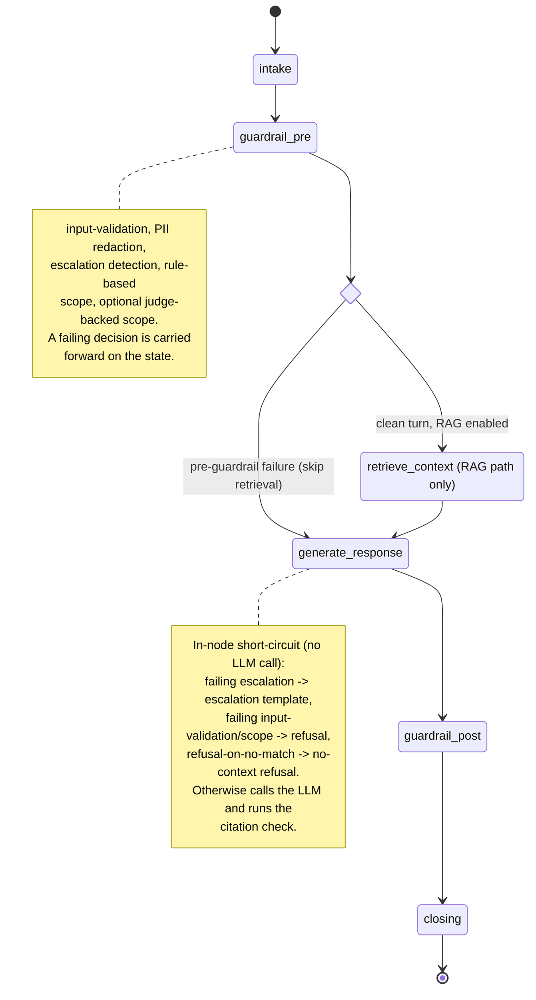
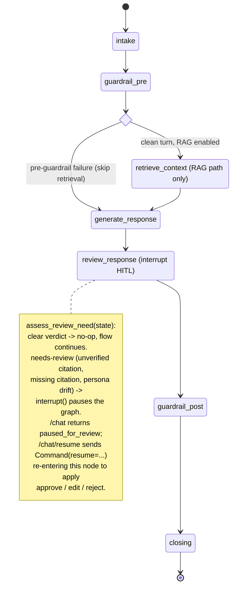

:::caution[Reference documentation: not a medical device]
This documentation describes a public reference implementation evaluated on 100% synthetic data. It is a capability and readiness reference, not a compliance certification or legal advice, and it is not a medical device. It is not clinically validated and handles no production PHI.
:::

# Agent State Machine

The LangGraph `StateGraph` for the medication-adherence agent. The agent
is a short, mostly-linear pipeline of graph nodes, not a multi-state
conversational machine: one `/chat` turn flows through it once.

The default build has six nodes:
`intake -> guardrail_pre -> [retrieve_context] -> generate_response ->
guardrail_post -> closing`. `retrieve_context` exists only when both a
vector store and an embedder are injected (the RAG path); with neither,
the graph degrades to a three-node shape (`intake -> guardrail_pre ->
generate_response -> guardrail_post -> closing`, retrieval absent).

Two real branch points exist:

- A conditional edge after `guardrail_pre`
  skips `retrieve_context` and routes straight to `generate_response`
  whenever `guardrail_pre` already attached a failing pre-guardrail
  decision (input-validation, scope, or escalation). The rejected turn
  would never use retrieved context, so embedding it is skipped (no wasted
  billable embedder call).
- `generate_response` short-circuits the LLM call to a deterministic
  template on three conditions: a failing escalation decision (emits the
  locale-aware escalation template), a failing input-validation / scope
  decision (emits a locale-aware refusal), or a `refusal-on-no-match`
  decision from `retrieve_context` (emits the no-context refusal). These
  are in-node branches, not graph edges; a short-circuited turn still
  flows through every downstream node.

When the graph is built with HITL enabled, a `review_response` node is
inserted between `generate_response` and `guardrail_post`. It calls
`assess_review_need` (a deterministic, total pure function over guardrail
decisions); when a high-risk-but-not-acute draft is detected (unverified
citation, missing citation on a RAG turn, or persona drift) it calls
LangGraph `interrupt()` to pause the graph for human sign-off. The
`/chat` handler returns `status="paused_for_review"`; the human resumes
through `POST /chat/resume`, which delivers a `Command(resume=...)` that
re-enters `review_response` and applies the decision (approve / edit /
reject). A `clear` verdict makes the node a no-op and the graph flows on
exactly as the six-node graph does. Acute red flags never reach this
pause: they are short-circuited upstream in `guardrail_pre`.

See [ADR-0001](../adr/adr-0001-orchestration.md) for the orchestration
rationale, [c4-component.md](./c4-component.md) for the node-and-module
decomposition, and [request-sequence.md](./request-sequence.md) for the
single-turn interaction flow.

The Agent Execution Graph in the demo single-page app
([ADR-0010](../adr/adr-0010-streaming-execution-graph.md))
is a live, in-browser visualization of this same topology: it draws the
real compiled node set and edges shown below and lights each node as a
turn streams. The streaming emission path and visualization did not change
the agent graph, so this diagram remains the authoritative topology
reference and the live graph must match it.

## Node graph (default build)

## Node graph with HITL enabled

