:::caution[Reference documentation: not a medical device]
This documentation describes a public reference implementation evaluated on 100% synthetic data. It is a capability and readiness reference, not a compliance certification or legal advice, and it is not a medical device. It is not clinically validated and handles no production PHI.
:::

# C4 Component - LangGraph Agent Runtime

The component view decomposes the `LangGraph Agent Runtime` container
(see [c4-container.md](/ai-agent-eval-harness-healthtech-docs/en/diagrams/c4-container/)) into the components a single
`/chat` turn actually executes: the graph nodes and the first-class
guardrail modules that those nodes invoke.

The FastAPI App enters the graph by one of two graph APIs, selected by
content negotiation on `/chat` and `/chat/resume`: `ainvoke` for a plain
JSON request and `astream` for an `Accept: text/event-stream` request,
whose per-node events the FastAPI App maps to a server-sent-events stream
that drives the live Agent Execution Graph in the single-page app. The
read-only `GET /graph/topology` endpoint returns the compiled graph's node
set and edges as JSON, read from the same compiled graph, so the SPA can
draw the idle-state graph before the first turn. Neither addition changes
the node set or the control flow below.

The agent is a six-node `StateGraph` (`intake -> guardrail_pre ->
[retrieve_context] -> generate_response -> guardrail_post -> closing`),
with `retrieve_context` present only on the RAG path and an optional
`review_response` HITL node inserted between `generate_response` and
`guardrail_post` when HITL is enabled. The guardrails are not a separate
orchestrated tier - they are modules called from inside three nodes:

- `guardrail_pre` calls `input_validation`, `pii`, `escalation`, and the
  rule-based (and optional judge-backed) `scope` classifier. A failing
  decision is carried forward on the state.
- `generate_response` reads those decisions to decide whether to
  short-circuit to a deterministic `refusal` or `escalation_templates`
  output; on the generation path it calls `citations` to extract and
  verify `[cite:ID]` markers.
- `guardrail_post` calls `citations` (the missing-citation check) and
  `persona` (persona-stability). Both are flag-only and never block.
- `review_response` (HITL only) calls `assess_review_need`, which
  reuses `citations` and `persona`, and renders an HITL-rejected template
  on a reject. It calls LangGraph `interrupt()` to pause for human
  sign-off.

See [agent-state-machine.md](/ai-agent-eval-harness-healthtech-docs/en/diagrams/agent-state-machine/) for the control
flow and [ADR-0005](/ai-agent-eval-harness-healthtech-docs/en/adr/adr-0005-guardrails/) for the guardrail
design.

```mermaid
C4Component
  title Component View - LangGraph Agent Runtime

  Container(api, "FastAPI App", "Python, FastAPI", "Runs the compiled graph via ainvoke (JSON) or astream (SSE); serves the read-only /graph/topology")
  ContainerDb(rag, "RAG Store", "Chroma embedded", "36 synthetic KB cards")
  Container(llm_client, "LLMClient Adapters", "Python", "OpenAI / Anthropic / Groq / Cerebras")
  ContainerDb(saver, "Checkpointer", "MemorySaver / AsyncPostgresSaver", "Persists paused HITL state")

  Container_Boundary(runtime, "LangGraph Agent Runtime") {
    Component(intake, "intake", "graph node", "Mints the trace id, increments the turn index")
    Component(gpre, "guardrail_pre", "graph node", "Runs the pre-generation guardrail checks in order")
    Component(retrieve, "retrieve_context", "graph node (RAG path)", "Embeds the user turn, queries the KB; flags refusal-on-no-match")
    Component(generate, "generate_response", "graph node", "Short-circuits on a failing decision, else calls the LLM and verifies citations")
    Component(review, "review_response", "graph node (HITL only)", "assess_review_need; interrupt() pauses high-risk drafts for human sign-off")
    Component(gpost, "guardrail_post", "graph node", "Missing-citation check and persona-stability check (flag-only)")
    Component(closing, "closing", "graph node", "Finalises the turn")
  }

  Container_Boundary(guardrails, "Guardrail Modules") {
    Component(input_validation, "input_validation", "module", "Refuses empty, oversized, or non-printable input")
    Component(pii, "pii", "module", "Deterministic PII redaction; optional LLM recheck")
    Component(scope, "scope", "module", "Rule-based and optional judge-backed scope classifier")
    Component(escalation, "escalation", "module", "Versioned red-flag regex; emits a structured escalation decision")
    Component(citations, "citations", "module", "Extracts and verifies [cite:ID]; missing-citation check")
    Component(persona, "persona", "module", "Persona-stability drift detection")
    Component(refusal, "refusal / escalation_templates", "modules", "Locale-aware refusal and escalation template renderers")
    Component(reviewmod, "review", "module", "assess_review_need verdict; render_hitl_rejected template")
  }

  Rel(api, intake, "ainvoke / astream enters the graph at")
  Rel(intake, gpre, "then")
  Rel(gpre, retrieve, "clean turn, RAG enabled")
  Rel(gpre, generate, "pre-guardrail failure (skips retrieval)")
  Rel(retrieve, generate, "then")
  Rel(generate, review, "then (HITL enabled)")
  Rel(generate, gpost, "then (HITL disabled)")
  Rel(review, gpost, "then")
  Rel(gpost, closing, "then")

  Rel(gpre, input_validation, "validates with")
  Rel(gpre, pii, "redacts with")
  Rel(gpre, escalation, "detects red flags with")
  Rel(gpre, scope, "classifies scope with")
  Rel(retrieve, rag, "queries")
  Rel(generate, llm_client, "generates with")
  Rel(generate, citations, "verifies citations with")
  Rel(generate, refusal, "renders short-circuit output with")
  Rel(gpost, citations, "missing-citation check with")
  Rel(gpost, persona, "checks persona drift with")
  Rel(review, reviewmod, "assesses review need with")
  Rel(review, saver, "persists paused state to")

  UpdateLayoutConfig($c4ShapeInRow="3", $c4BoundaryInRow="1")
```

