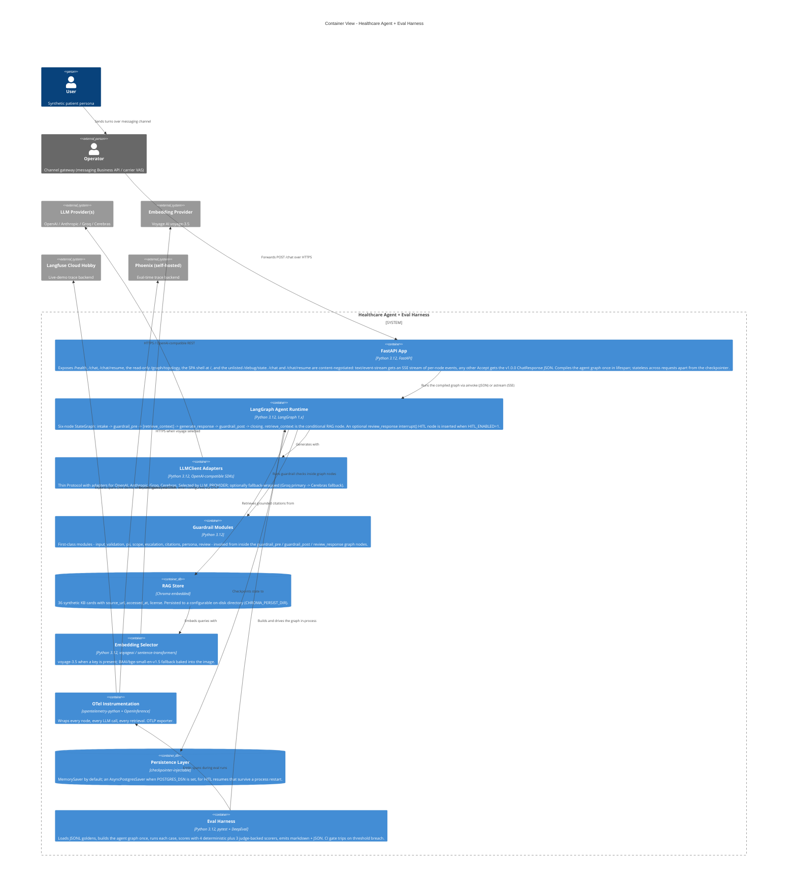

:::caution[Reference documentation: not a medical device]
This documentation describes a public reference implementation evaluated on 100% synthetic data. It is a capability and readiness reference, not a compliance certification or legal advice, and it is not a medical device. It is not clinically validated and handles no production PHI.
:::

# C4 Container - `ai-agent-eval-harness-healthtech`

The container view decomposes the agent system into deployable units. A
FastAPI app fronts the public surface (`/health`, `/chat`,
`/chat/resume`, and the read-only `/graph/topology`) plus the single-page
app shell at `/`; there is no `/metrics` endpoint. `/chat` and
`/chat/resume` are content-negotiated: an `Accept: text/event-stream`
request gets a server-sent-events stream of per-node execution events, any
other `Accept` gets the stable `ChatResponse` JSON. The LangGraph agent
runtime owns the conversational pipeline: the six-node graph `intake ->
guardrail_pre -> [retrieve_context] -> generate_response -> guardrail_post
-> closing`, with an optional `review_response` human-in-the-loop (HITL)
node inserted between `generate_response` and `guardrail_post` when HITL is
enabled. The guardrail modules run inside the graph nodes (`guardrail_pre`
and `guardrail_post`), not as a separate orchestrated tier. The RAG store
is Chroma embedded, grounded on a synthetic KB of 36 cards. The evaluation
harness runs out of process, building the same graph. OpenTelemetry
instrumentation wires every node to the observability backends.

The graph is compiled once when the FastAPI app starts up and is reused
across requests. The persistence layer is checkpointer-injectable: an
in-memory checkpointer by default, or a durable Postgres-backed
checkpointer when a database connection string is configured (the durable
path for HITL resumes spanning a process restart). See
[ADR-0001](../adr/adr-0001-orchestration.md) for the rationale.

The RAG store uses hybrid retrieval: BM25 lexical matching plus dense
vectors (BAAI BGE) plus a cross-encoder rerank, fused via reciprocal rank
fusion, over semantically chunked KB cards with parent-document retrieval.
The eval harness scores each case with four always-on deterministic
scorers plus three judge-backed scorers; the judge model is Cerebras
`gpt-oss-120b`. A threshold breach trips the CI gate.
