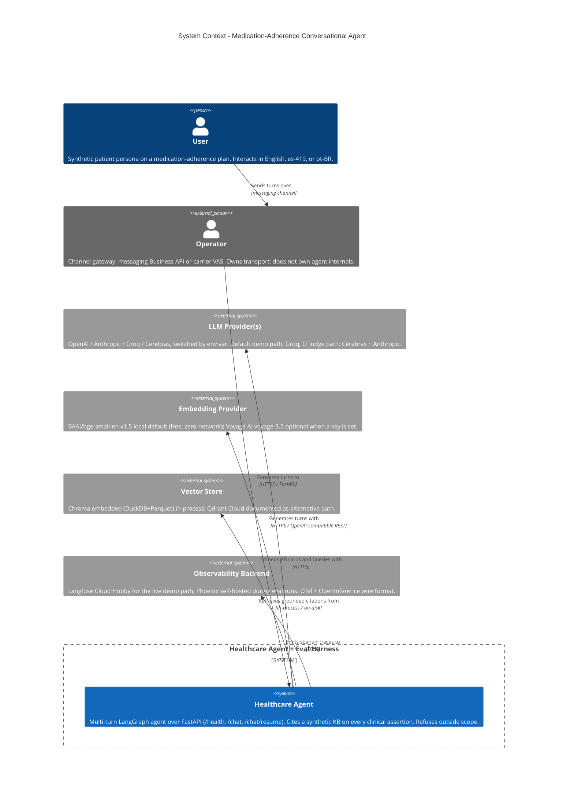

:::caution[Reference documentation: not a medical device]
This documentation describes a public reference implementation evaluated on 100% synthetic data. It is a capability and readiness reference, not a compliance certification or legal advice, and it is not a medical device. It is not clinically validated and handles no production PHI.
:::

# C4 Context - `ai-agent-eval-harness-healthtech`

The context view shows the system boundary of the medication-adherence
conversational agent and the external systems it depends on. The system
is exercised by a User (synthetic patient persona) and integrated by an
Operator (a generic channel gateway - for example a messaging Business
API or a carrier value-added-service surface). External technical
dependencies are split into LLM providers, an embedding provider, the
vector store, and an observability backend.

See also [c4-container.md](/ai-agent-eval-harness-healthtech-docs/en/diagrams/c4-container/) for the next-level
decomposition.

The retrieval path uses a local dense embedding model (BAAI BGE) as the
default; the diagram's embedding provider also reflects a documented
hosted-embedding alternative. Dense vectors are combined with BM25 lexical
matching and a cross-encoder rerank, fused via reciprocal rank fusion, so
every grounded citation comes from the hybrid retriever.
