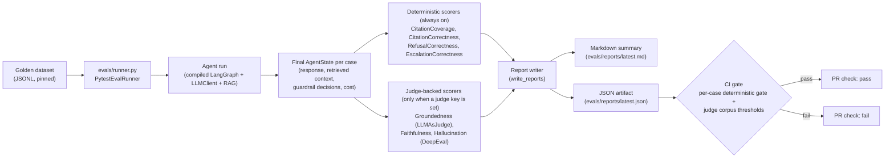

:::caution[Reference documentation: not a medical device]
This documentation describes a public reference implementation evaluated on 100% synthetic data. It is a capability and readiness reference, not a compliance certification or legal advice, and it is not a medical device. It is not clinically validated and handles no production PHI.
:::

# Evals Pipeline

The eval harness reads a pinned JSONL golden dataset, runs each case
end-to-end through the same compiled LangGraph agent the production path
uses (it builds the graph once per run, with HITL off), dispatches each
final agent state to a composable set of scorers, and emits both a
markdown summary and a JSON artifact. The CI gate consumes the JSON
artifact; a deterministic per-case failure or a judge-backed
corpus-threshold breach yields a non-zero exit code and fails the PR
check.

The runner default uses two groups of scorers:

- Always-on deterministic scorers (no LLM, no key required) gate every
  PR: `CitationCoverageScorer`, `CitationCorrectnessScorer`,
  `RefusalCorrectnessScorer`, `EscalationCorrectnessScorer`.
- Judge-backed scorers attach only when a judge client is supplied (a
  Cerebras API key is set): `GroundednessScorer`
  (via `LLMAsJudge` directly), `FaithfulnessScorer` and
  `HallucinationScorer` (via DeepEval's `FaithfulnessMetric` /
  `HallucinationMetric`). With no judge key the run reports the judge as
  disabled and the threshold gate runs against the deterministic scorers
  only. The judge model is Cerebras `gpt-oss-120b`.

See [ADR-0003](../adr/adr-0003-eval-harness.md) for the threshold policy
and [ADR-0009](../adr/adr-0009-judge-model-cerebras.md) for the judge-model
choice.

