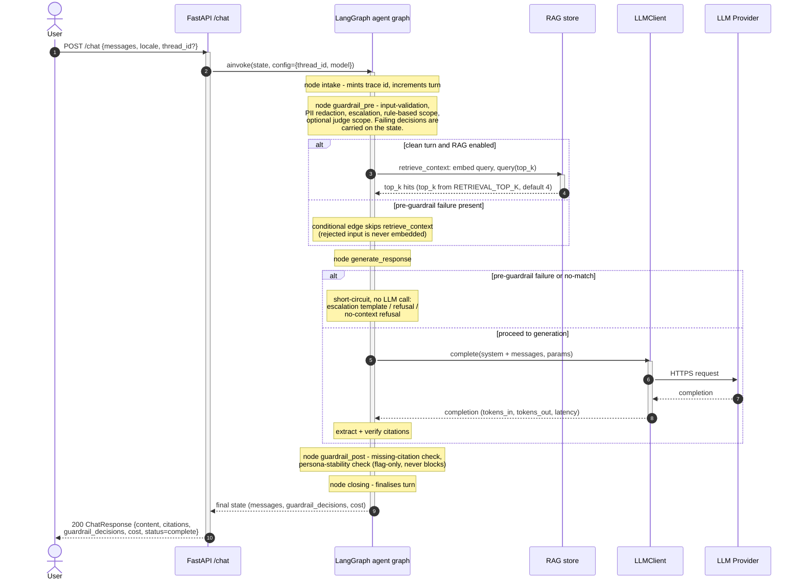
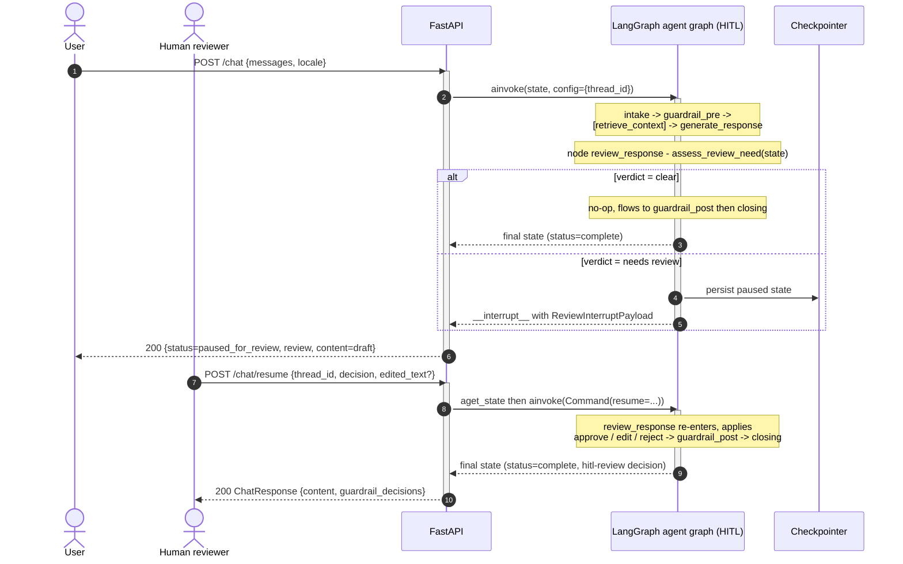

:::caution[Reference documentation: not a medical device]
This documentation describes a public reference implementation evaluated on 100% synthetic data. It is a capability and readiness reference, not a compliance certification or legal advice, and it is not a medical device. It is not clinically validated and handles no production PHI.
:::

# Request Sequence - One Turn

The sequence of interactions that handles a single user turn through
`POST /chat`. The FastAPI handler runs the turn through the compiled
LangGraph graph; which graph API it uses depends on content negotiation.
A plain JSON request (any `Accept` that is not `text/event-stream`) is
run via `ainvoke` and returns a `ChatResponse`. A request that carries
`Accept: text/event-stream` is run via `astream` and returns a
server-sent-events stream of per-node execution events; the Agent
Execution Graph in the demo single-page app consumes that stream. The
streaming variant is the second sequence below. Either way the guardrails
are not a tier the API orchestrates around the graph - they run *as graph
nodes*. `guardrail_pre` runs after `intake`; `guardrail_post` runs after
`generate_response`. A failing pre-guardrail decision is carried forward
on the state and short-circuits the LLM call inside `generate_response`;
the turn still flows through every downstream node, so even a refusal or
no-match turn comes back as an assistant message in the graph's final
state. OpenTelemetry spans are opened in every node and around the LLM
call.

See [c4-container.md](./c4-container.md) for the static decomposition and
[c4-component.md](./c4-component.md) for the node-and-module view.

## Single completed turn



## HITL pause and resume

When the graph is compiled with HITL enabled, a `review_response` node
sits between `generate_response` and `guardrail_post`. A
high-risk-but-not-acute draft pauses the graph via LangGraph
`interrupt()`; the turn is resumed by a separate `POST /chat/resume` call.



## Streaming turn (`Accept: text/event-stream`)

When the request asks for `text/event-stream`, the handler drives the
same compiled graph through `astream` instead of `ainvoke` and maps each
per-node LangGraph event to a server-sent-events record. The stream
opens with a `graph_topology` event (so the SPA draws the real node set
before any node runs), then emits a `node_started` / `node_completed`
pair per executed node and a synthesized `skipped` `node_completed` per
genuinely bypassed conditional node, and ends with a terminal
`turn_completed` event carrying the full `ChatResponse`. A failure after
the first byte is an in-stream `error` event; a failure before the first
byte is a normal HTTP error. See
[ADR-0010](../adr/adr-0010-streaming-execution-graph.md) for the event
schema.

```mermaid
sequenceDiagram
  autonumber

  actor Client as SSE client (demo SPA)
  participant API as FastAPI /chat
  participant Graph as LangGraph agent graph

  Client->>API: POST /chat (Accept: text/event-stream)
  activate API
  Note over API: content negotiation selects the SSE path;<br/>build the graph_topology payload before streaming
  API-->>Client: 200 text/event-stream (Cache-Control: no-cache,<br/>X-Accel-Buffering: no)
  API-->>Client: event: graph_topology (real node set + edges + flags)
  API->>Graph: astream(state, config={thread_id, model})
  activate Graph

  loop per executed node, in graph order
    Graph-->>API: node lifecycle event
    API-->>Client: event: node_started {node, run_id, ts_ms}
    Note over Graph: node body runs (guardrails / retrieval /<br/>generation), spans opened as in the JSON path
    Graph-->>API: node lifecycle event
    API-->>Client: event: node_completed {node, status=executed,<br/>duration_ms}
  end

  opt a conditional node was genuinely bypassed
    Note over API: diff topology vs nodes that emitted events
    API-->>Client: event: node_completed {status=skipped,<br/>duration_ms=0}
  end

  Graph-->>API: final state
  deactivate Graph
  API-->>Client: event: turn_completed { ...full ChatResponse... }
  deactivate API
```

A streaming HITL turn ends its `/chat` stream with a `paused` event
(carrying the `ReviewInterruptPayload`) instead of `turn_completed`, and
closes; the turn continues on a fresh `POST /chat/resume` SSE stream that
opens with its own `graph_topology` event, re-emits the post-pause
nodes, and ends with `turn_completed` carrying an envelope-level
`human_wait_ms`.
