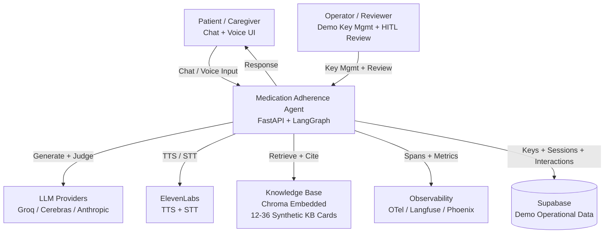
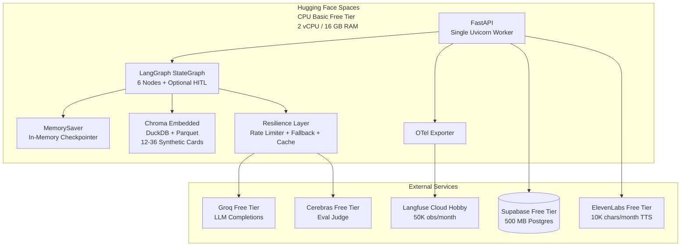
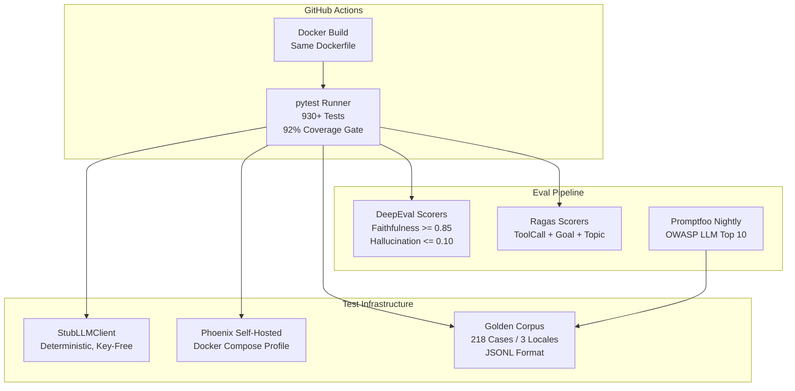
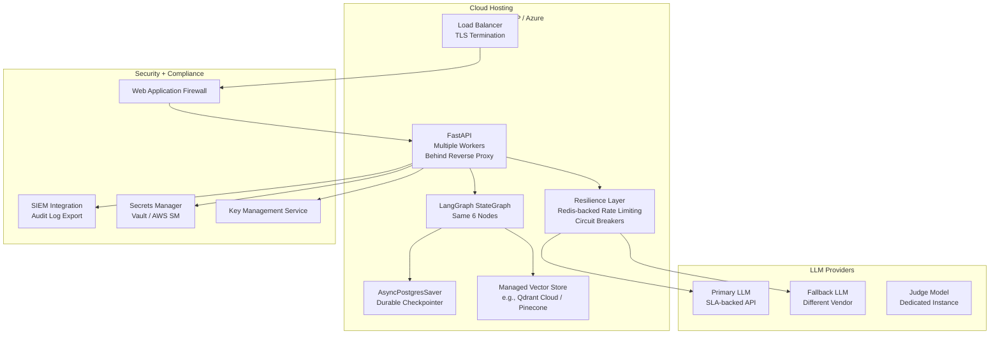
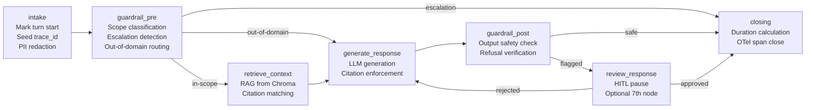

:::caution[Reference documentation: not a medical device]
This documentation describes a public reference implementation evaluated on 100% synthetic data. It is a capability and readiness reference, not a compliance certification or legal advice, and it is not a medical device. It is not clinically validated and handles no production PHI.
:::

# Enterprise Agent Stack: Demo vs Production Reference

## Purpose

This document maps the gap between the current demo reference implementation and what a production deployment would require. It serves operators planning to adapt the demo into a real deployment, and readers assessing the reference implementation's production awareness.

The architecture is presented across five layers (Compute/Hosting, Storage/Data, AI/ML, Observability, Security/Compliance) using Mermaid diagrams for visual clarity.

## Scope

This covers the medication-adherence conversational agent as deployed on Hugging Face Spaces, the CI/eval pipeline, and a generic production reference architecture. It does not prescribe a specific cloud vendor; the production reference identifies what a real deployment would need, not which vendor to use.

---

## 1. System Context Diagram

The highest-level view: who uses the system, what external systems it depends on, and what data flows between them.

**Key boundaries:**

- The agent is the sole trust boundary. All user input enters through FastAPI and passes through the guardrail pipeline before reaching any external system.
- LLM providers, ElevenLabs, and observability sinks are external dependencies. The agent degrades gracefully when any of them are unavailable.
- Supabase stores operational data (demo keys, interactions, improvement suggestions) but the agent continues serving turns if it is down.

---

## 2. Container Diagrams

Three deployment contexts: the live demo, the CI/eval pipeline, and a production reference.

### 2.1 Demo Container (Current -- $0/month)

**Cost: $0/month** across all services. Each provider's free tier covers demo-scale traffic (50-150 reviewers, 5-10 turns each). Cold start is 10-30 seconds after 48 hours of idle.

### 2.2 CI/Eval Container

**Determinism guarantee:** The CI gate passes key-free via a deterministic stub LLM client. Judge-backed scorers activate only when a Cerebras key is set. The same Docker image that passes CI is the image that ships to HF Spaces.

### 2.3 Production Reference Container

**Production gap:** The demo runs on a single free-tier worker with in-memory state. Production needs load balancing, durable persistence, managed secrets, WAF, SIEM, and SLA-backed LLM providers. The architecture is the same (six-node LangGraph StateGraph) -- only the infrastructure layers change.

---

## 3. Component Diagram: Agent Graph Internals

The six-node LangGraph StateGraph with the optional seventh HITL node.

**Data flow:**

1. **intake** -- marks the turn start, seeds the trace ID, applies PII redaction.
2. **guardrail_pre** -- runs the scope classifier. In-scope messages proceed to RAG retrieval. Out-of-domain messages bypass retrieval and get a graceful fallback. Escalation-triggering messages short-circuit to closing with a referral.
3. **retrieve_context** -- queries Chroma embedded for relevant KB cards. If no card matches, the agent refuses rather than hallucinating.
4. **generate_response** -- calls the configured LLM provider with the retrieved context and a citation-enforcing prompt.
5. **guardrail_post** -- verifies the generated response does not contain dosing, diagnosis, or other out-of-scope content. Flagged responses route to HITL review.
6. **closing** -- calculates turn duration, closes the OTel span, and returns the response.
7. **review_response** (optional) -- a LangGraph interrupt for human-in-the-loop review of flagged turns. Disabled by default in eval mode.

---

## 4. Five-Layer Comparison: Demo vs Production

| Layer | Demo (Current) | Production Reference |
|-------|---------------|---------------------|
| **Compute/Hosting** | HF Spaces CPU Basic free tier; single uvicorn worker; 2 vCPU / 16 GB RAM; sleeps after 48h idle; 10-30s cold start | Cloud hosting (AWS/GCP/Azure); multiple workers behind load balancer; auto-scaling; zero-downtime deploys; SLA-backed uptime |
| **Storage/Data** | Chroma embedded (DuckDB+Parquet) for RAG; in-memory `MemorySaver` for conversation state; Supabase free tier (500 MB) for demo operational data | Managed vector store (Qdrant Cloud / Pinecone) for RAG; `AsyncPostgresSaver` for durable conversation state; managed Postgres (RDS / Cloud SQL) with backups for operational data; data encryption at rest |
| **AI/ML** | Groq free tier for LLM completions; Cerebras free tier for eval judge; BAAI/bge-small-en-v1.5 for embeddings; deterministic stub LLM client for CI; synthetic KB cards | SLA-backed LLM API with dedicated throughput; fine-tuned judge model; managed embedding service; expanded knowledge base with clinical review; continuous eval with drift detection |
| **Observability** | OTel spans with OpenInference conventions; Langfuse Cloud Hobby (50K obs/month); Phoenix self-hosted in Docker for eval runs; OTLP export | Full OTel stack with collector, sampling, and retention policies; dedicated observability backend (Datadog / Grafana / Honeycomb); alerting on latency, error rate, and cost anomalies; audit log export to SIEM |
| **Security/Compliance** | No secrets in repo (gitleaks CI); lockfile pinned; Dependabot enabled; no PHI / no real EHR; FDA General Wellness framing; PII redaction at ingress | WAF / DDoS protection; managed secrets (Vault / AWS Secrets Manager); BAA with all LLM providers; HIPAA Security Rule compliance; SOC 2 Type II; penetration testing; incident response plan |

---

## 5. Layer Details

### 5.1 Compute/Hosting

**Current state.** The demo runs on Hugging Face Spaces CPU Basic free tier. A single uvicorn worker serves all requests. The Space sleeps after 48 hours of idle traffic and auto-wakes on the next request with a 10-30 second cold start. The same Dockerfile builds in CI, in local development, and on HF Spaces.

**Production gap.** A production deployment needs multiple workers behind a load balancer, auto-scaling to handle traffic spikes, zero-downtime deployments, and SLA-backed uptime (typically 99.9% or higher). Cold starts must be eliminated. The agent code itself is portable -- FastAPI with uvicorn works behind any reverse proxy -- but the infrastructure layer needs significant investment.

**Migration path.** The same Docker image can deploy to any Docker-capable host. The Render Web Service free tier is documented as a fallback (see [deploy](deploy.md)). Moving to production means choosing a cloud provider, configuring auto-scaling, and adding TLS termination at the load balancer level.

### 5.2 Storage/Data

**Current state.** RAG retrieval uses Chroma embedded (DuckDB+Parquet), which is zero-network and runs entirely within the Space's memory. Conversation state uses in-memory `MemorySaver` by default; it is lost on Space restart. Demo operational data (keys, sessions, interactions) is stored in Supabase free tier (500 MB managed Postgres). The knowledge base contains synthetic KB cards in JSONL format.

**Production gap.** A production deployment needs durable conversation state (`AsyncPostgresSaver` via a Postgres connection string). RAG retrieval should use a managed vector store (Qdrant Cloud, Pinecone, or pgvector in the operational Postgres) for persistence, larger corpus support, and query performance at scale. Operational data needs a managed Postgres with automated backups, point-in-time recovery, and encryption at rest.

**Migration path.** The agent already provisions a durable Postgres checkpointer factory via a connection string. Switching from Chroma embedded to a managed vector store requires updating the retriever configuration but not the agent graph itself. The committed JSONL format is already compatible with bulk loading into any vector store.

### 5.3 AI/ML

**Current state.** LLM completions use Groq free tier by default, with Cerebras free tier as the eval judge and Anthropic as a pluggable option. Embeddings use `BAAI/bge-small-en-v1.5` locally (no API call). The eval harness uses DeepEval + Ragas + Promptfoo with synthetic golden cases across three locales (en, es-419, pt-BR). The knowledge base covers several medication-adherence domains with synthetic cards.

**Production gap.** Free-tier LLM APIs have rate limits, no SLAs, and shared infrastructure. A production deployment needs SLA-backed LLM providers with guaranteed throughput and latency. The eval judge should run on a dedicated instance for consistency. The knowledge base would need clinical review and expansion beyond synthetic data. Continuous eval with drift detection is essential for production safety.

**Migration path.** The client Protocol makes provider swapping a configuration change. Adding a new provider requires implementing the Protocol (at most a handful of methods) and setting the `LLM_PROVIDER` environment variable. The eval harness already scores against configurable thresholds and is CI-gated.

### 5.4 Observability

**Current state.** OpenTelemetry spans with OpenInference semantic conventions wrap every node, LLM call, retrieval, and guardrail decision. Two sinks: Langfuse Cloud Hobby for the live demo (50K observations/month, 30-day retention) and Phoenix self-hosted via Docker Compose for eval runs. No alerting is configured.

**Production gap.** A production deployment needs a full OTel stack: collector with configurable sampling, a dedicated backend with long retention (90+ days), alerting on latency percentiles, error rates, and cost anomalies, and audit log export to SIEM for compliance. The current spans already carry the right attributes; the gap is in the backend infrastructure, not the instrumentation.

**Migration path.** The OTel instrumentation is vendor-neutral. Switching backends is an OTLP exporter configuration change. The existing span attributes (`interaction.*`, `llm.*`, `retrieval.*`) are compatible with any OTel-compatible backend.

### 5.5 Security/Compliance

**Current state.** No secrets in the repository (enforced by gitleaks in CI). Dependencies are pinned via the lockfile with Dependabot monitoring. No PHI, no real EHR data, no patient-identifiable information (100% synthetic data). The agent operates under FDA 2026 General Wellness / CDS framing (see [regulatory posture](regulatory-posture.md)). PII redaction is applied at ingress. Demo key fingerprinting uses anonymized sha256 with daily rotation.

**Production gap.** A production deployment handling real patient data would need: Web Application Firewall and DDoS protection, managed secrets (Vault, AWS Secrets Manager), Business Associate Agreements with all LLM providers, HIPAA Security Rule compliance (risk assessment, breach notification, minimum necessary access), SOC 2 Type II certification, regular penetration testing, and an incident response plan. The regulatory posture would shift from General Wellness to a full compliance framework.

**Migration path.** The guardrail architecture is designed for production: deterministic scope classification, auditable refusal templates, and hard-coded escalation categories are all production-grade patterns. The security gap is primarily in infrastructure (WAF, secrets management, encryption) and process (risk assessments, audit schedules), not in the application code.

---

## Cross-References

| Topic | ADR |
|-------|-----|
| Orchestration framework (six-node StateGraph) | [ADR-0001](../adr/adr-0001-orchestration.md) |
| LLM vendor abstraction (Protocol + adapters) | [ADR-0002](../adr/adr-0002-llm-vendor-abstraction.md) |
| Eval harness (DeepEval + Ragas + Promptfoo) | [ADR-0003](../adr/adr-0003-eval-harness.md) |
| RAG stack (Chroma embedded) | [ADR-0004](../adr/adr-0004-rag-stack.md) |
| Guardrails (scope + refusal + escalation) | [ADR-0005](../adr/adr-0005-guardrails.md) |
| Observability (OTel + OpenInference) | [ADR-0006](../adr/adr-0006-observability.md) |
| Deployment (HF Spaces + Docker SDK) | [ADR-0007](../adr/adr-0007-deployment.md) |
| Data layer (Supabase free tier) | [ADR-0011](../adr/adr-0011-data-layer-supabase.md) |
| Voice extension (ElevenLabs TTS/STT) | [ADR-0014](../adr/adr-0014-voice-extension.md) |
| Streaming architecture (SSE events) | [ADR-0010](../adr/adr-0010-streaming-execution-graph.md) |
