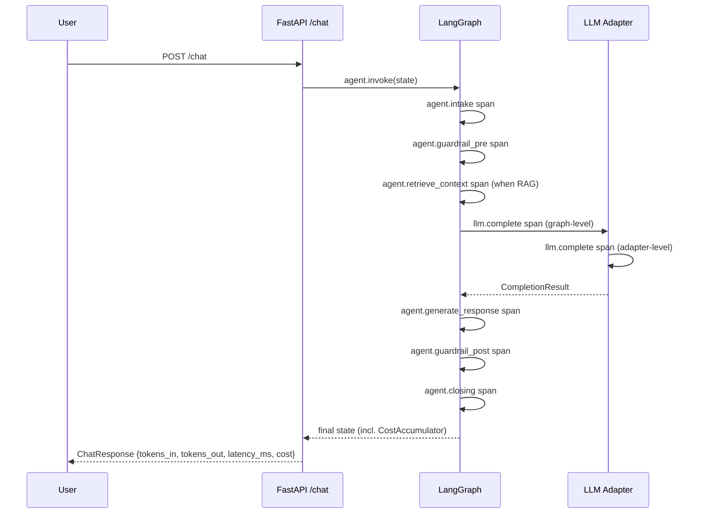

:::caution[Reference documentation: not a medical device]
This documentation describes a public reference implementation evaluated on 100% synthetic data. It is a capability and readiness reference, not a compliance certification or legal advice, and it is not a medical device. It is not clinically validated and handles no production PHI.
:::

# Observability

> One wire format (OpenTelemetry + OpenInference), three exporter
> destinations (Langfuse Cloud Hobby, Phoenix self-hosted, generic OTLP),
> and a per-turn cost + latency accumulator that lands on every
> `/chat` response and every eval report. See
> [ADR-0006](../adr/adr-0006-observability.md) for the decision; this file
> is the operator manual.

## 1. Overview

The agent emits OpenTelemetry spans annotated with OpenInference
semantic conventions. Spans cover the LangGraph nodes
(`agent.intake`, `agent.guardrail_pre`, `agent.retrieve_context`,
`agent.generate_response`, `agent.guardrail_post`, `agent.closing`,
plus `agent.review_response` when the optional HITL node is enabled)
plus the LLM call (`llm.complete`). Token counts, latency, model name,
and decision counts ride on the spans as attributes. The user's
message text never does.

Three backends consume the same wire format:

- **Langfuse Cloud Hobby** for the **live demo** on Hugging Face
  Spaces. Free tier: 50K observations / month, 30-day retention,
  hosted UI with public-link sharing.
- **Phoenix self-hosted** for **eval CI**. Brought up via the optional
  Docker Compose stack; no quota, no external network.
- **Generic OTLP/HTTP** for operators who already ship traces to
  Datadog, Grafana, Honeycomb, or any other OTLP-compatible stack.
  Configured via `OTLP_ENDPOINT`.

All three backends are off by default. The agent still produces a
`TracerProvider` with an in-memory exporter that drops spans, so
`tracer.start_as_current_span(...)` is always safe to call.

## 2. Wire format

The agent uses OpenInference, the Arize semantic conventions for
GenAI. OpenInference rides on top of OpenTelemetry and adds
LLM-specific attributes that plain OTel does not cover (model,
provider, token usage, retrieval contexts, tool calls).

Auto-instrumentation for LangChain (covers LangGraph), OpenAI, and
Anthropic is installed when the optional `obs` extra is present. The
agent code also emits explicit spans for every node + every LLM call,
so the trace tree is readable even when the auto-instrumentation is
absent (e.g. inside a unit-test process).

## 3. The three backends

### 3.1 Langfuse Cloud Hobby (live demo)

Default for the Hugging Face Spaces live demo.

Sign up at <https://cloud.langfuse.com>, create a project, copy the
public + secret keys.

```bash
export LANGFUSE_PUBLIC_KEY=pk-lf-...
export LANGFUSE_SECRET_KEY=sk-lf-...
# Optional; defaults to https://cloud.langfuse.com
export LANGFUSE_HOST=https://cloud.langfuse.com
```

Restart the API; the FastAPI lifespan installs a Langfuse-bound OTLP
span processor on top of the default processor. Open the Langfuse
dashboard at `${LANGFUSE_HOST}/project/...` to inspect traces.

### 3.2 Phoenix self-hosted (eval CI)

Default for the offline eval runs.

```bash
make obs-up
export PHOENIX_OTLP_ENDPOINT=http://localhost:6006/v1/traces
uv run python -m ai_agent_eval.evals run --locale all --with-phoenix
```

Phoenix listens on `:6006` (UI + OTLP/HTTP) and `:4317` (OTLP/gRPC).
The trace store persists in the `phoenix_data` Docker volume; bring
the stack down with `make obs-down` when you are done.

### 3.3 Generic OTLP/HTTP

For operators who already have an OTLP endpoint.

```bash
export OTLP_ENDPOINT=https://otlp.example.com/v1/traces
```

The lifespan installs an `OTLPSpanExporter` aimed at that URL.

### 3.4 Pydantic Logfire (documented alternative)

Logfire ships a Python SDK with a 10M-spans-per-month free tier
effective 2026-01-01. The OpenInference wire format means swapping
to Logfire is a configuration change, not a code change: install
`logfire`, configure its OTLP exporter against
`https://logfire-api.pydantic.dev/v1/traces`, and disable the
Langfuse processor. The distribution does not ship a first-class
Logfire backend module - it is left to the operator who picks it.

## 4. Span model



The agent always emits an `llm.complete` span at the graph layer.
Real adapters (Groq, Cerebras, Anthropic) emit a second `llm.complete`
span at the adapter layer for the actual HTTP call. Test fakes do not
own a tracer, so the graph-layer span keeps the topology consistent.

Per-node timing is also surfaced outside the OTel pipeline. The SSE
streaming mode on `/chat` and `/chat/resume` (see
[ADR-0010](../adr/adr-0010-streaming-execution-graph.md)) emits a
`node_started` and a `node_completed` event per executed node, the
`node_completed` carrying an emitter-measured `duration_ms` - the
wall-clock interval between the node's start and end events for the
matched run id. That figure is measured independently of the OTel spans
above (it is not a tracing-span duration) and feeds the demo's Agent
Execution Graph; the OTel spans remain the authoritative observability
record exported to Langfuse and Phoenix.

## 5. What is logged (and what is NOT)

Every span carries METADATA only:

- `service.name`, `service.namespace=healthtech-demo`,
  `service.version`, `deployment.environment`
- `agent.node` (one of `intake / guardrail_pre / retrieve_context /
  generate_response / guardrail_post / closing`)
- `agent.tokens_in`, `agent.tokens_out`, `agent.latency_ms`
- `agent.guardrail_decisions_count`, `agent.citations_count`
- `llm.provider` (`groq` / `cerebras` / `anthropic`), `llm.model`,
  `llm.tokens_in`, `llm.tokens_out`, `llm.latency_ms`,
  `llm.finish_reason`

**No span attribute carries the user message text, the assistant
response text, or any PHI.** This is enforced by a dedicated unit
test that asserts the privacy invariant. Violating this invariant means
a failing CI gate. The motivation is the
[regulatory posture](regulatory-posture.md): traces leave
the local process; user messages must not.

If you need to inspect a transcript, do it from the FastAPI logs in
the trusted environment, NOT from the trace store. Future work could
add an opt-in `trace.include_content=True` knob with explicit
operator acknowledgement; today the answer is "no".

## 6. Cost & latency budgets

Per-turn budgets live on the application settings:

| Setting | Default | Env var |
| --- | --- | --- |
| `cost_budget_tokens_in_per_turn` | 4000 | `COST_BUDGET_TOKENS_IN_PER_TURN` |
| `cost_budget_tokens_out_per_turn` | 1000 | `COST_BUDGET_TOKENS_OUT_PER_TURN` |
| `cost_budget_latency_ms_per_turn` | 8000 | `COST_BUDGET_LATENCY_MS_PER_TURN` |

The eval runner compares the corpus-average per-turn numbers against
these budgets. The cost gate is **strict and PR-blocking** by default:
the eval CLI exits non-zero when the corpus average per turn breaches
any budget, and the human-readable report carries a per-dimension status
table and a resolved `[cost-gate=PASS|WARN|FAIL|off]` line under the
"Cost & latency" section. Pass `--cost-gate warn` for warn-only
behaviour or `--cost-gate off` to suppress cost rendering entirely. As a
key-free escape valve, the strict gate auto-degrades to warn-only when
no judge-capable provider key is set, so a keyless PR cannot fail on
cost.

To override the budget defaults, set the env vars (a `.env` file works
the same way as the LLM keys).

## 7. Local quickstart

```bash
# 1. Boot the optional observability stack (Phoenix).
make obs-up

# 2. Wire the eval CLI to ship traces to Phoenix.
export PHOENIX_OTLP_ENDPOINT=http://localhost:6006/v1/traces
uv run python -m ai_agent_eval.evals run \
  --locale all \
  --with-phoenix \
  --report-dir evals/reports

# 3. Open the Phoenix UI.
#    http://localhost:6006
```

For the live API + Langfuse:

```bash
export LANGFUSE_PUBLIC_KEY=pk-lf-...
export LANGFUSE_SECRET_KEY=sk-lf-...
uv run uvicorn ai_agent_eval.api.main:app --reload
# Open https://cloud.langfuse.com/project/<id>/traces
```

## 8. Free-tier ceiling

Langfuse Cloud Hobby caps at **50K observations / month** with no
overage billing - spike traffic above the cap is dropped silently.
This is intentional: the live demo URL keeps a `$0 / month` cost
guarantee.

When the ceiling is hit, options:

1. **Stop sending traces** to Langfuse: unset
   `LANGFUSE_PUBLIC_KEY` / `LANGFUSE_SECRET_KEY` and redeploy.
2. **Switch to Logfire** (10M spans/month free): see §3.4.
3. **Upgrade Langfuse** to Pro (paid tier).
4. **Self-host Langfuse** via the commented service in the optional
   Docker Compose stack.

For the eval CI path, the Phoenix self-hosted backend has no quota
ceiling on trace storage; the operative constraint there is the
strict, PR-blocking cost gate (§6), not an observation quota.

## 9. Failure modes

| Symptom | Likely cause | Fix |
| --- | --- | --- |
| No spans in Langfuse | Keys unset or wrong host | Recheck env vars |
| `make obs-up` errors | Docker daemon not running | Start Docker |
| Phoenix UI empty | `PHOENIX_OTLP_ENDPOINT` unset on the producer | Export the env var before running the eval |
| `make eval` hangs > 10 s | OTLP exporter blocked on a missing endpoint | Unset OTLP endpoints / restart the eval |
| Cost report missing | Cost units never recorded | The graph appends cost units from the generation node; confirm against the cost-report test path |
