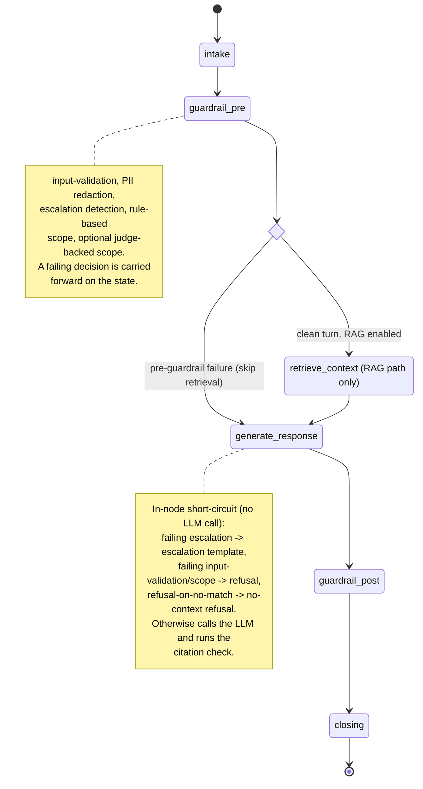
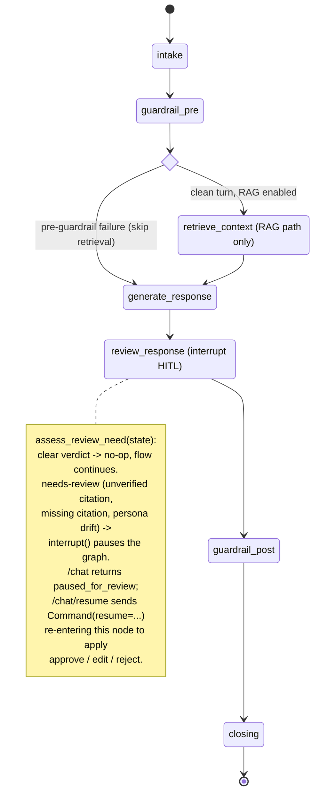

:::caution[Documentación de referencia: no es un dispositivo médico]
Esta documentación describe una implementación de referencia pública evaluada con datos 100% sintéticos. Es una referencia de capacidades y preparación, no una certificación de cumplimiento ni asesoría legal, y no es un dispositivo médico. No está validada clínicamente y no maneja PHI de producción.
:::

# Máquina de estados del agente

El `StateGraph` de LangGraph para el agente de adherencia a la medicación. El
agente es una canalización de nodos del grafo corta y mayormente lineal, no una
máquina conversacional multiestado: un turno de `/chat` fluye a través de ella
una sola vez.

La compilación por defecto tiene seis nodos:
`intake -> guardrail_pre -> [retrieve_context] -> generate_response ->
guardrail_post -> closing`. `retrieve_context` existe solo cuando se inyectan
tanto un almacén vectorial como un embebedor (la ruta RAG); sin ninguno de los
dos, el grafo se degrada a una forma de tres nodos (`intake -> guardrail_pre ->
generate_response -> guardrail_post -> closing`, sin recuperación).

Existen dos puntos de ramificación reales:

- Una arista condicional después de `guardrail_pre` omite `retrieve_context` y
  enruta directamente a `generate_response` siempre que `guardrail_pre` ya haya
  adjuntado una decisión de rechazo previa a la generación (validación de
  entrada, scope o escalación). El turno rechazado nunca usaría el contexto
  recuperado, así que se omite generar su embedding (sin una llamada facturable
  al embebedor desperdiciada).
- `generate_response` hace un cortocircuito de la llamada al LLM hacia una
  plantilla determinista en tres condiciones: una decisión de escalación de
  rechazo (emite la plantilla de escalación adaptada al idioma), una decisión de
  rechazo de validación de entrada / scope (emite una rehusa adaptada al idioma),
  o una decisión de `refusal-on-no-match` proveniente de `retrieve_context`
  (emite la rehusa por falta de contexto). Estas son ramificaciones internas del
  nodo, no aristas del grafo; un turno que hace cortocircuito igual fluye a
  través de todos los nodos subsiguientes.

Cuando el grafo se construye con HITL habilitado, se inserta un nodo
`review_response` entre `generate_response` y `guardrail_post`. Llama a
`assess_review_need` (una función pura, total y determinista sobre las decisiones
de las barreras de seguridad); cuando se detecta un borrador de alto riesgo pero
no agudo (citación no verificada, citación faltante en un turno RAG o desviación
de la persona), llama a `interrupt()` de LangGraph para pausar el grafo a la
espera de la aprobación humana. El handler de `/chat` devuelve
`status="paused_for_review"`; el humano reanuda mediante `POST /chat/resume`, que
entrega un `Command(resume=...)` que vuelve a entrar a `review_response` y aplica
la decisión (aprobar / editar / rechazar). Un veredicto `clear` convierte al
nodo en un no-op y el grafo continúa exactamente como lo hace el grafo de seis
nodos. Las señales de alerta agudas nunca llegan a esta pausa: se les hace
cortocircuito aguas arriba en `guardrail_pre`.

Consulta [ADR-0001](../adr/adr-0001-orchestration.md) para la justificación de
la orquestación, [c4-component.md](./c4-component.md) para la descomposición en
nodos y módulos, y [request-sequence.md](./request-sequence.md) para el flujo de
interacción de un solo turno.

El grafo de ejecución del agente en la aplicación de página única de la demo
([ADR-0010](../adr/adr-0010-streaming-execution-graph.md))
es una visualización en vivo, dentro del navegador, de esta misma topología:
dibuja el conjunto real de nodos y aristas del grafo compilado que se muestra
abajo e ilumina cada nodo a medida que un turno se transmite. La ruta de emisión
en streaming y la visualización no cambiaron el grafo del agente, así que este
diagrama sigue siendo la referencia autoritativa de la topología y el grafo en
vivo debe coincidir con él.

## Grafo de nodos (compilación por defecto)

## Grafo de nodos con HITL habilitado

