:::caution[Documentación de referencia: no es un dispositivo médico]
Esta documentación describe una implementación de referencia pública evaluada con datos 100% sintéticos. Es una referencia de capacidades y preparación, no una certificación de cumplimiento ni asesoría legal, y no es un dispositivo médico. No está validada clínicamente y no maneja PHI de producción.
:::

# Componentes C4 - Runtime del agente LangGraph

La vista de componentes descompone el contenedor `LangGraph Agent Runtime`
(consulta [c4-container.md](/ai-agent-eval-harness-healthtech-docs/es-419/diagrams/c4-container/)) en los componentes que un único
turno de `/chat` ejecuta realmente: los nodos del grafo y los módulos de
barreras de seguridad de primera clase que esos nodos invocan.

La app de FastAPI entra al grafo por una de dos APIs del grafo, seleccionada
por negociación de contenido en `/chat` y `/chat/resume`: `ainvoke` para una
solicitud JSON simple y `astream` para una solicitud `Accept: text/event-stream`,
cuyos eventos por nodo la app de FastAPI mapea a un flujo de eventos enviados
por el servidor (server-sent events) que impulsa el grafo de ejecución del
agente en vivo en la aplicación de página única. El endpoint de solo lectura
`GET /graph/topology` devuelve el conjunto de nodos y aristas del grafo
compilado como JSON, leído desde el mismo grafo compilado, de modo que la SPA
puede dibujar el grafo en estado inactivo antes del primer turno. Ninguna de
estas dos adiciones cambia el conjunto de nodos ni el flujo de control que sigue.

El agente es un `StateGraph` de seis nodos (`intake -> guardrail_pre ->
[retrieve_context] -> generate_response -> guardrail_post -> closing`), con
`retrieve_context` presente solo en la ruta RAG y un nodo HITL opcional
`review_response` insertado entre `generate_response` y `guardrail_post` cuando
HITL está habilitado. Las barreras de seguridad no son un nivel orquestado
aparte; son módulos llamados desde el interior de tres nodos:

- `guardrail_pre` llama a `input_validation`, `pii`, `escalation` y al
  clasificador `scope` basado en reglas (y opcionalmente respaldado por un juez).
  Una decisión de rechazo se arrastra en el estado.
- `generate_response` lee esas decisiones para decidir si hacer un
  cortocircuito hacia una salida determinista de `refusal` o
  `escalation_templates`; en la ruta de generación llama a `citations` para
  extraer y verificar los marcadores `[cite:ID]`.
- `guardrail_post` llama a `citations` (la verificación de citación faltante) y
  a `persona` (estabilidad de la persona). Ambas son solo de marcado y nunca
  bloquean.
- `review_response` (solo HITL) llama a `assess_review_need`, que reutiliza
  `citations` y `persona`, y renderiza una plantilla de rechazo por HITL ante un
  rechazo. Llama a `interrupt()` de LangGraph para pausar a la espera de la
  aprobación humana.

Consulta [agent-state-machine.md](/ai-agent-eval-harness-healthtech-docs/es-419/diagrams/agent-state-machine/) para el flujo de
control y [ADR-0005](/ai-agent-eval-harness-healthtech-docs/es-419/adr/adr-0005-guardrails/) para el diseño de las
barreras de seguridad.

```mermaid
C4Component
  title Component View - LangGraph Agent Runtime

  Container(api, "FastAPI App", "Python, FastAPI", "Runs the compiled graph via ainvoke (JSON) or astream (SSE); serves the read-only /graph/topology")
  ContainerDb(rag, "RAG Store", "Chroma embedded", "36 synthetic KB cards")
  Container(llm_client, "LLMClient Adapters", "Python", "OpenAI / Anthropic / Groq / Cerebras")
  ContainerDb(saver, "Checkpointer", "MemorySaver / AsyncPostgresSaver", "Persists paused HITL state")

  Container_Boundary(runtime, "LangGraph Agent Runtime") {
    Component(intake, "intake", "graph node", "Mints the trace id, increments the turn index")
    Component(gpre, "guardrail_pre", "graph node", "Runs the pre-generation guardrail checks in order")
    Component(retrieve, "retrieve_context", "graph node (RAG path)", "Embeds the user turn, queries the KB; flags refusal-on-no-match")
    Component(generate, "generate_response", "graph node", "Short-circuits on a failing decision, else calls the LLM and verifies citations")
    Component(review, "review_response", "graph node (HITL only)", "assess_review_need; interrupt() pauses high-risk drafts for human sign-off")
    Component(gpost, "guardrail_post", "graph node", "Missing-citation check and persona-stability check (flag-only)")
    Component(closing, "closing", "graph node", "Finalises the turn")
  }

  Container_Boundary(guardrails, "Guardrail Modules") {
    Component(input_validation, "input_validation", "module", "Refuses empty, oversized, or non-printable input")
    Component(pii, "pii", "module", "Deterministic PII redaction; optional LLM recheck")
    Component(scope, "scope", "module", "Rule-based and optional judge-backed scope classifier")
    Component(escalation, "escalation", "module", "Versioned red-flag regex; emits a structured escalation decision")
    Component(citations, "citations", "module", "Extracts and verifies [cite:ID]; missing-citation check")
    Component(persona, "persona", "module", "Persona-stability drift detection")
    Component(refusal, "refusal / escalation_templates", "modules", "Locale-aware refusal and escalation template renderers")
    Component(reviewmod, "review", "module", "assess_review_need verdict; render_hitl_rejected template")
  }

  Rel(api, intake, "ainvoke / astream enters the graph at")
  Rel(intake, gpre, "then")
  Rel(gpre, retrieve, "clean turn, RAG enabled")
  Rel(gpre, generate, "pre-guardrail failure (skips retrieval)")
  Rel(retrieve, generate, "then")
  Rel(generate, review, "then (HITL enabled)")
  Rel(generate, gpost, "then (HITL disabled)")
  Rel(review, gpost, "then")
  Rel(gpost, closing, "then")

  Rel(gpre, input_validation, "validates with")
  Rel(gpre, pii, "redacts with")
  Rel(gpre, escalation, "detects red flags with")
  Rel(gpre, scope, "classifies scope with")
  Rel(retrieve, rag, "queries")
  Rel(generate, llm_client, "generates with")
  Rel(generate, citations, "verifies citations with")
  Rel(generate, refusal, "renders short-circuit output with")
  Rel(gpost, citations, "missing-citation check with")
  Rel(gpost, persona, "checks persona drift with")
  Rel(review, reviewmod, "assesses review need with")
  Rel(review, saver, "persists paused state to")

  UpdateLayoutConfig($c4ShapeInRow="3", $c4BoundaryInRow="1")
```

