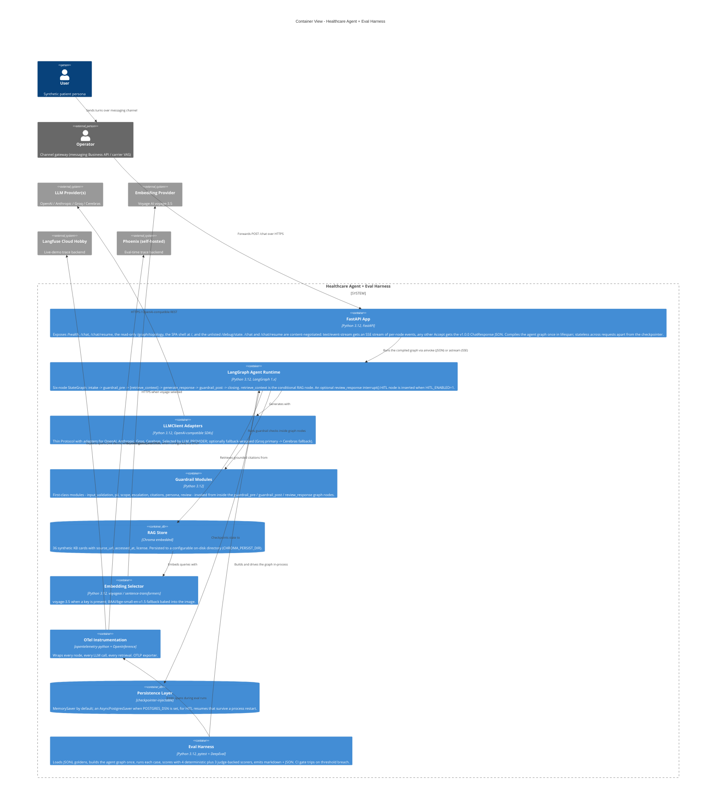

:::caution[Documentación de referencia: no es un dispositivo médico]
Esta documentación describe una implementación de referencia pública evaluada con datos 100% sintéticos. Es una referencia de capacidades y preparación, no una certificación de cumplimiento ni asesoría legal, y no es un dispositivo médico. No está validada clínicamente y no maneja PHI de producción.
:::

# Contenedores C4 - `ai-agent-eval-harness-healthtech`

La vista de contenedores descompone el sistema del agente en unidades
desplegables. Una app de FastAPI expone la superficie pública (`/health`,
`/chat`, `/chat/resume` y el endpoint de solo lectura `/graph/topology`),
además del shell de la aplicación de página única en `/`; no hay un endpoint
`/metrics`. `/chat` y `/chat/resume` usan negociación de contenido: una
solicitud con `Accept: text/event-stream` obtiene un flujo de eventos enviados
por el servidor (server-sent events) con los eventos de ejecución por nodo,
y cualquier otro `Accept` obtiene el JSON estable `ChatResponse`. El runtime
del agente LangGraph es dueño de la canalización conversacional: el grafo de
seis nodos `intake -> guardrail_pre -> [retrieve_context] -> generate_response
-> guardrail_post -> closing`, con un nodo opcional `review_response` con humano
en el bucle (HITL) insertado entre `generate_response` y `guardrail_post` cuando
HITL está habilitado. Los módulos de barreras de seguridad se ejecutan dentro
de los nodos del grafo (`guardrail_pre` y `guardrail_post`), no como un nivel
orquestado aparte. El almacén RAG es Chroma embebido, fundamentado en una base
de conocimiento sintética de 36 tarjetas. El arnés de evaluación se ejecuta
fuera de proceso y construye el mismo grafo. La instrumentación de OpenTelemetry
conecta cada nodo con los backends de observabilidad.

El grafo se compila una sola vez cuando arranca la app de FastAPI y se reutiliza
entre solicitudes. La capa de persistencia admite inyección de checkpointer:
un checkpointer en memoria por defecto, o un checkpointer durable respaldado por
Postgres cuando se configura una cadena de conexión a la base de datos (la ruta
durable para reanudaciones HITL que abarcan un reinicio de proceso). Consulta
[ADR-0001](/ai-agent-eval-harness-healthtech-docs/es-419/adr/adr-0001-orchestration/) para conocer la justificación.

El almacén RAG usa recuperación híbrida: coincidencia léxica BM25, más vectores
densos (BAAI BGE), más un reordenamiento por cross-encoder, fusionados mediante
fusión recíproca de rangos (RRF), sobre tarjetas de la base de conocimiento
fragmentadas semánticamente con recuperación de documento padre. El arnés de
evaluación puntúa cada caso con cuatro puntuadores deterministas siempre activos,
más tres puntuadores respaldados por un juez; el modelo juez es Cerebras
`gpt-oss-120b`. Una violación de umbral activa la barrera de CI.
