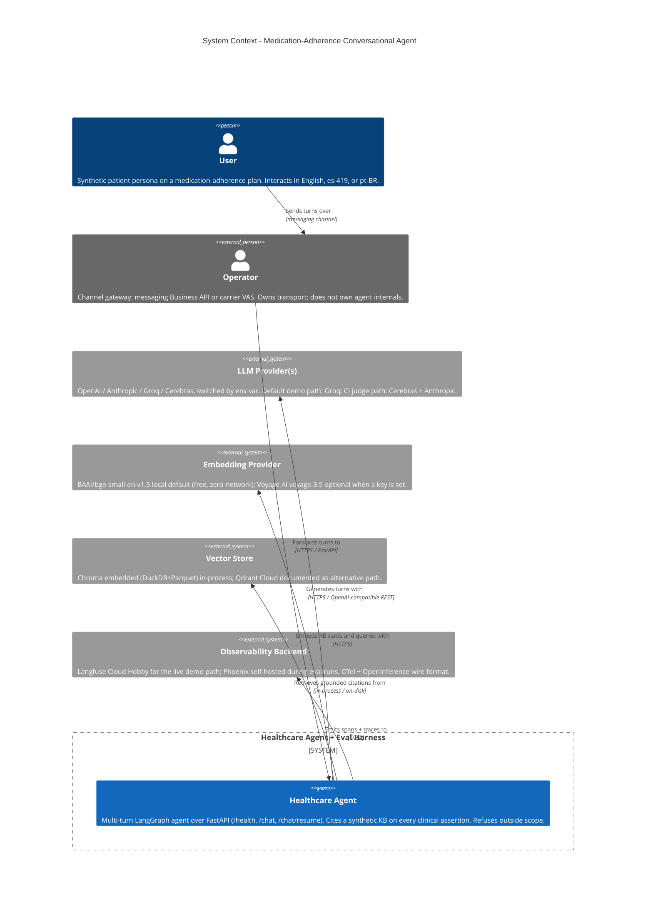

:::caution[Documentación de referencia: no es un dispositivo médico]
Esta documentación describe una implementación de referencia pública evaluada con datos 100% sintéticos. Es una referencia de capacidades y preparación, no una certificación de cumplimiento ni asesoría legal, y no es un dispositivo médico. No está validada clínicamente y no maneja PHI de producción.
:::

# Contexto C4 - `ai-agent-eval-harness-healthtech`

La vista de contexto muestra el límite del sistema del agente conversacional
de adherencia a la medicación y los sistemas externos de los que depende. El
sistema lo ejercita un Usuario (persona de paciente sintético) y lo integra un
Operador (una pasarela de canal genérica; por ejemplo, una API de mensajería
para empresas o una superficie de servicio de valor agregado de una operadora).
Las dependencias técnicas externas se dividen en proveedores de LLM, un
proveedor de embeddings, el almacén vectorial y un backend de observabilidad.

Consulta también [c4-container.md](./c4-container.md) para la descomposición
del siguiente nivel.

La ruta de recuperación usa por defecto un modelo local de embeddings densos
(BAAI BGE); el proveedor de embeddings del diagrama también refleja una
alternativa documentada de embeddings alojados. Los vectores densos se combinan
con la coincidencia léxica BM25 y un reordenamiento por cross-encoder, fusionados
mediante fusión recíproca de rangos (RRF), de modo que cada citación fundamentada
proviene del recuperador híbrido.
