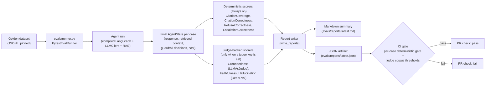

:::caution[Documentación de referencia: no es un dispositivo médico]
Esta documentación describe una implementación de referencia pública evaluada con datos 100% sintéticos. Es una referencia de capacidades y preparación, no una certificación de cumplimiento ni asesoría legal, y no es un dispositivo médico. No está validada clínicamente y no maneja PHI de producción.
:::

# Canalización de evaluación

El arnés de evaluación lee un conjunto de datos golden JSONL fijado, ejecuta
cada caso de extremo a extremo a través del mismo agente LangGraph compilado que
usa la ruta de producción (construye el grafo una vez por ejecución, con HITL
desactivado), despacha cada estado final del agente a un conjunto componible de
puntuadores y emite tanto un resumen en markdown como un artefacto JSON. La
barrera de CI consume el artefacto JSON; una falla determinista por caso o una
violación de umbral del corpus respaldada por un juez produce un código de salida
distinto de cero y hace fallar la verificación del PR.

La ejecución por defecto del runner usa dos grupos de puntuadores:

- Puntuadores deterministas siempre activos (sin LLM, sin clave requerida)
  condicionan cada PR: `CitationCoverageScorer`, `CitationCorrectnessScorer`,
  `RefusalCorrectnessScorer`, `EscalationCorrectnessScorer`.
- Los puntuadores respaldados por un juez se adjuntan solo cuando se suministra
  un cliente juez (se configura una clave de API de Cerebras): `GroundednessScorer`
  (vía `LLMAsJudge` directamente), `FaithfulnessScorer` y `HallucinationScorer`
  (vía `FaithfulnessMetric` / `HallucinationMetric` de DeepEval). Sin una clave de
  juez, la ejecución reporta el juez como deshabilitado y la barrera de umbral se
  ejecuta solo contra los puntuadores deterministas. El modelo juez es Cerebras
  `gpt-oss-120b`.

Consulta [ADR-0003](/ai-agent-eval-harness-healthtech-docs/es-419/adr/adr-0003-eval-harness/) para la política de umbrales
y [ADR-0009](/ai-agent-eval-harness-healthtech-docs/es-419/adr/adr-0009-judge-model-cerebras/) para la elección del modelo
juez.

