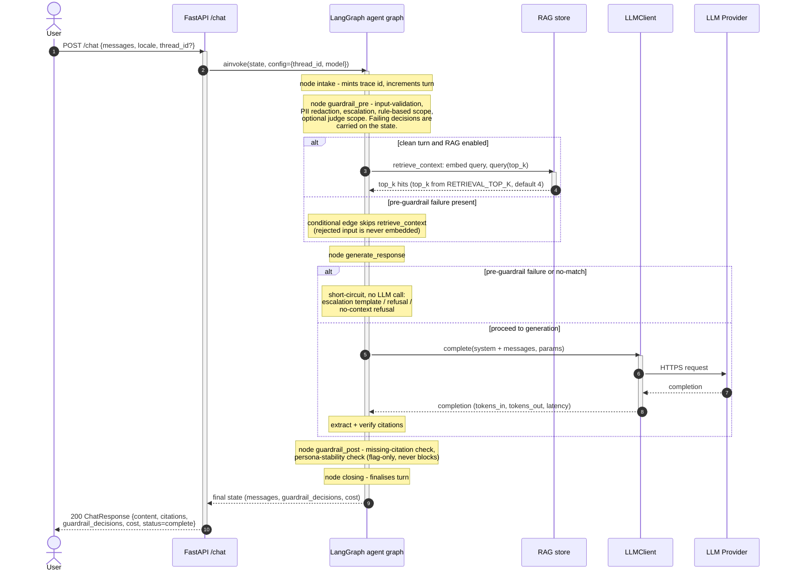
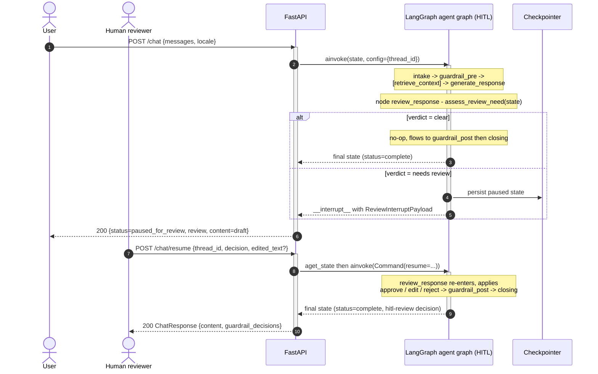

:::caution[Documentación de referencia: no es un dispositivo médico]
Esta documentación describe una implementación de referencia pública evaluada con datos 100% sintéticos. Es una referencia de capacidades y preparación, no una certificación de cumplimiento ni asesoría legal, y no es un dispositivo médico. No está validada clínicamente y no maneja PHI de producción.
:::

# Secuencia de solicitudes - Un turno

La secuencia de interacciones que maneja un único turno de usuario a través de
`POST /chat`. El handler de FastAPI ejecuta el turno a través del grafo LangGraph
compilado; la API del grafo que usa depende de la negociación de contenido. Una
solicitud JSON simple (cualquier `Accept` que no sea `text/event-stream`) se
ejecuta vía `ainvoke` y devuelve un `ChatResponse`. Una solicitud que lleva
`Accept: text/event-stream` se ejecuta vía `astream` y devuelve un flujo de
eventos enviados por el servidor (server-sent events) con los eventos de
ejecución por nodo; el grafo de ejecución del agente en la aplicación de página
única de la demo consume ese flujo. La variante de streaming es la segunda
secuencia más abajo. En cualquier caso, las barreras de seguridad no son un nivel
que la API orqueste alrededor del grafo; se ejecutan *como nodos del grafo*.
`guardrail_pre` se ejecuta después de `intake`; `guardrail_post` se ejecuta
después de `generate_response`. Una decisión de rechazo previa a la generación se
arrastra en el estado y hace cortocircuito de la llamada al LLM dentro de
`generate_response`; el turno igual fluye a través de todos los nodos
subsiguientes, así que incluso un turno de rehusa o sin coincidencia regresa como
un mensaje del asistente en el estado final del grafo. Se abren spans de
OpenTelemetry en cada nodo y alrededor de la llamada al LLM.

Consulta [c4-container.md](/ai-agent-eval-harness-healthtech-docs/es-419/diagrams/c4-container/) para la descomposición estática y
[c4-component.md](/ai-agent-eval-harness-healthtech-docs/es-419/diagrams/c4-component/) para la vista de nodos y módulos.

## Un turno completado



## Pausa y reanudación HITL

Cuando el grafo se compila con HITL habilitado, un nodo `review_response` se
ubica entre `generate_response` y `guardrail_post`. Un borrador de alto riesgo
pero no agudo pausa el grafo vía `interrupt()` de LangGraph; el turno se reanuda
mediante una llamada `POST /chat/resume` aparte.



## Turno en streaming (`Accept: text/event-stream`)

Cuando la solicitud pide `text/event-stream`, el handler impulsa el mismo grafo
compilado a través de `astream` en lugar de `ainvoke` y mapea cada evento de
LangGraph por nodo a un registro de eventos enviados por el servidor
(server-sent events). El flujo abre con un evento `graph_topology` (para que la
SPA dibuje el conjunto real de nodos antes de que se ejecute cualquier nodo),
luego emite un par `node_started` / `node_completed` por cada nodo ejecutado y
un `node_completed` `skipped` sintetizado por cada nodo condicional genuinamente
omitido, y termina con un evento terminal `turn_completed` que lleva el
`ChatResponse` completo. Una falla después del primer byte es un evento `error`
dentro del flujo; una falla antes del primer byte es un error HTTP normal.
Consulta [ADR-0010](/ai-agent-eval-harness-healthtech-docs/es-419/adr/adr-0010-streaming-execution-graph/) para el esquema
de eventos.

```mermaid
sequenceDiagram
  autonumber

  actor Client as SSE client (demo SPA)
  participant API as FastAPI /chat
  participant Graph as LangGraph agent graph

  Client->>API: POST /chat (Accept: text/event-stream)
  activate API
  Note over API: content negotiation selects the SSE path;<br/>build the graph_topology payload before streaming
  API-->>Client: 200 text/event-stream (Cache-Control: no-cache,<br/>X-Accel-Buffering: no)
  API-->>Client: event: graph_topology (real node set + edges + flags)
  API->>Graph: astream(state, config={thread_id, model})
  activate Graph

  loop per executed node, in graph order
    Graph-->>API: node lifecycle event
    API-->>Client: event: node_started {node, run_id, ts_ms}
    Note over Graph: node body runs (guardrails / retrieval /<br/>generation), spans opened as in the JSON path
    Graph-->>API: node lifecycle event
    API-->>Client: event: node_completed {node, status=executed,<br/>duration_ms}
  end

  opt a conditional node was genuinely bypassed
    Note over API: diff topology vs nodes that emitted events
    API-->>Client: event: node_completed {status=skipped,<br/>duration_ms=0}
  end

  Graph-->>API: final state
  deactivate Graph
  API-->>Client: event: turn_completed { ...full ChatResponse... }
  deactivate API
```

Un turno HITL en streaming termina su flujo de `/chat` con un evento `paused`
(que lleva el `ReviewInterruptPayload`) en lugar de `turn_completed`, y se cierra;
el turno continúa en un nuevo flujo SSE de `POST /chat/resume` que abre con su
propio evento `graph_topology`, vuelve a emitir los nodos posteriores a la pausa
y termina con `turn_completed` que lleva un `human_wait_ms` a nivel del sobre.
