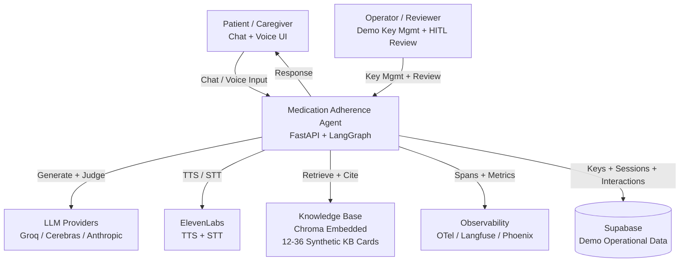
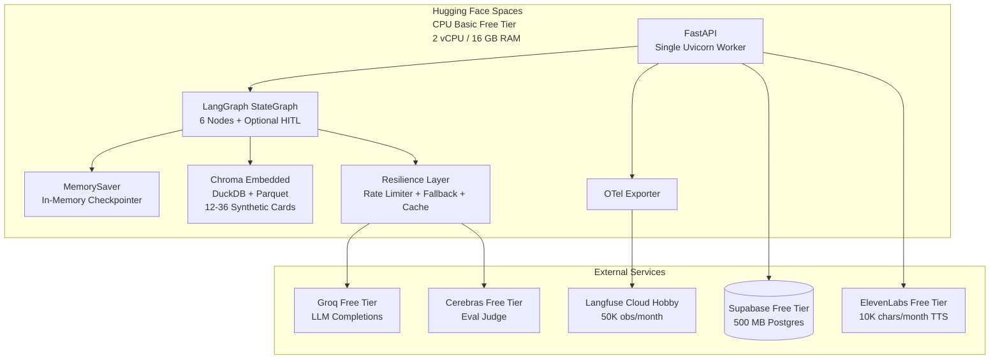
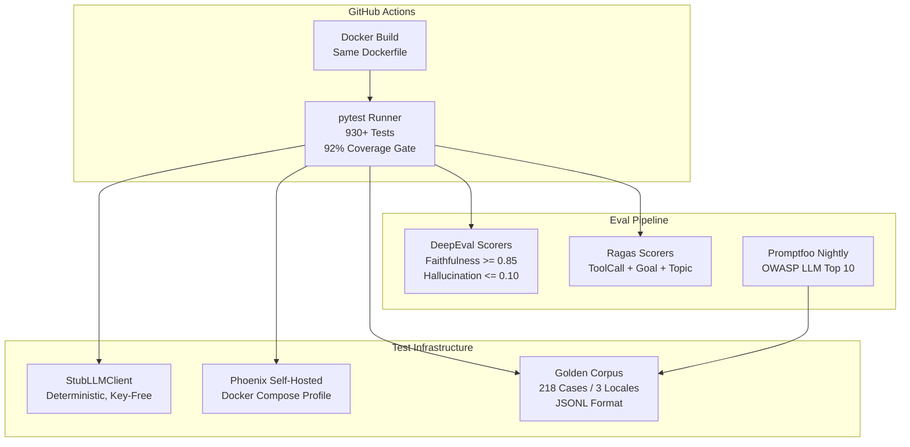
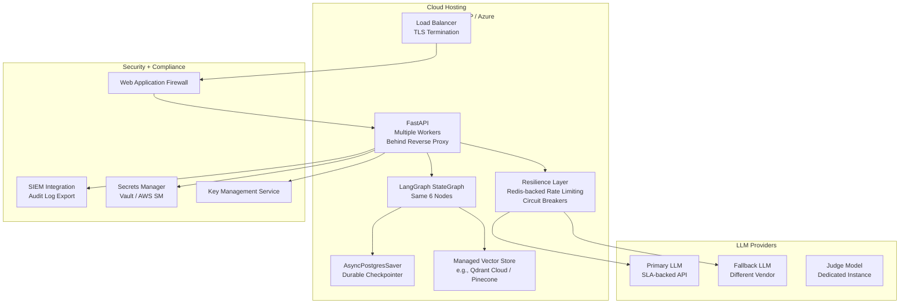
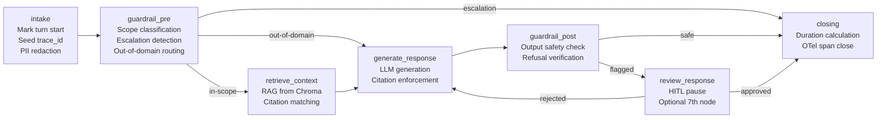

:::caution[Documentación de referencia: no es un dispositivo médico]
Esta documentación describe una implementación de referencia pública evaluada con datos 100% sintéticos. Es una referencia de capacidades y preparación, no una certificación de cumplimiento ni asesoría legal, y no es un dispositivo médico. No está validada clínicamente y no maneja PHI de producción.
:::

# Stack empresarial del agente: demo vs referencia de producción

## Propósito

Este documento mapea la brecha entre la implementación de referencia actual
de la demo y lo que requeriría un despliegue de producción. Sirve a los
operadores que planean adaptar la demo a un despliegue real, y a los lectores
que evalúan la conciencia de producción de la implementación de referencia.

La arquitectura se presenta a lo largo de cinco capas (Cómputo/Hospedaje,
Almacenamiento/Datos, IA/ML, Observabilidad, Seguridad/Cumplimiento) usando
diagramas Mermaid para mayor claridad visual.

## Alcance

Esto cubre el agente conversacional de adherencia a la medicación tal como
está desplegado en Hugging Face Spaces, la canalización de CI/evaluación y
una arquitectura de referencia de producción genérica. No prescribe un
proveedor de nube específico; la referencia de producción identifica lo que
un despliegue real necesitaría, no qué proveedor usar.

---

## 1. Diagrama de contexto del sistema

La vista de más alto nivel: quién usa el sistema, de qué sistemas externos
depende y qué datos fluyen entre ellos.

**Límites clave:**

- El agente es el único límite de confianza. Todo el input del usuario entra
  a través de FastAPI y pasa por la canalización de barreras de seguridad
  antes de alcanzar cualquier sistema externo.
- Los proveedores de LLM, ElevenLabs y los destinos de observabilidad son
  dependencias externas. El agente se degrada con elegancia cuando alguno de
  ellos no está disponible.
- Supabase almacena datos operativos (claves de la demo, interacciones,
  sugerencias de mejora) pero el agente sigue sirviendo turnos si está caído.

---

## 2. Diagramas de contenedores

Tres contextos de despliegue: la demo en vivo, la canalización de
CI/evaluación y una referencia de producción.

### 2.1 Contenedor de la demo (actual -- $0/mes)

**Costo: $0/mes** en todos los servicios. El nivel gratuito de cada
proveedor cubre el tráfico a escala de demo (50-150 revisores, 5-10 turnos
cada uno). El arranque en frío es de 10-30 segundos tras 48 horas de
inactividad.

### 2.2 Contenedor de CI/evaluación

**Garantía de determinismo:** La puerta de CI pasa sin claves a través de un
cliente LLM de prueba (stub) determinista. Los scorers respaldados por juez
se activan únicamente cuando se configura una clave de Cerebras. La misma
imagen de Docker que pasa la CI es la imagen que se entrega a HF Spaces.

### 2.3 Contenedor de referencia de producción

**Brecha de producción:** La demo se ejecuta en un único worker de nivel
gratuito con estado en memoria. Producción necesita balanceo de carga,
persistencia durable, secretos gestionados, WAF, SIEM y proveedores de LLM
respaldados por SLA. La arquitectura es la misma (StateGraph de LangGraph de
seis nodos) -- solo cambian las capas de infraestructura.

---

## 3. Diagrama de componentes: interioridades del grafo del agente

El StateGraph de LangGraph de seis nodos con el séptimo nodo opcional de
HITL.

**Flujo de datos:**

1. **intake** -- marca el inicio del turno, siembra el ID de traza, aplica
   la redacción de PII.
2. **guardrail_pre** -- ejecuta el clasificador de alcance. Los mensajes
   dentro del alcance avanzan a la recuperación RAG. Los mensajes fuera de
   dominio omiten la recuperación y obtienen una alternativa elegante. Los
   mensajes que disparan escalamiento hacen cortocircuito hacia el cierre con
   una derivación.
3. **retrieve_context** -- consulta Chroma embebido en busca de tarjetas de
   KB relevantes. Si ninguna tarjeta coincide, el agente se rehúsa en lugar
   de alucinar.
4. **generate_response** -- llama al proveedor de LLM configurado con el
   contexto recuperado y un prompt que exige citación.
5. **guardrail_post** -- verifica que la respuesta generada no contenga
   contenido de dosificación, diagnóstico u otro contenido fuera de alcance.
   Las respuestas marcadas se enrutan a la revisión HITL.
6. **closing** -- calcula la duración del turno, cierra el span de OTel y
   devuelve la respuesta.
7. **review_response** (opcional) -- una interrupción de LangGraph para la
   revisión con humano en el bucle de los turnos marcados. Desactivada por
   defecto en el modo de evaluación.

---

## 4. Comparación de cinco capas: demo vs producción

| Capa | Demo (actual) | Referencia de producción |
|-------|---------------|---------------------|
| **Cómputo/Hospedaje** | Nivel gratuito CPU Basic de HF Spaces; un único worker de uvicorn; 2 vCPU / 16 GB RAM; se duerme tras 48 h de inactividad; arranque en frío de 10-30 s | Hospedaje en la nube (AWS/GCP/Azure); múltiples workers tras un balanceador de carga; autoescalado; despliegues sin tiempo de inactividad; disponibilidad respaldada por SLA |
| **Almacenamiento/Datos** | Chroma embebido (DuckDB+Parquet) para RAG; `MemorySaver` en memoria para el estado de la conversación; nivel gratuito de Supabase (500 MB) para los datos operativos de la demo | Almacén de vectores gestionado (Qdrant Cloud / Pinecone) para RAG; `AsyncPostgresSaver` para el estado durable de la conversación; Postgres gestionado (RDS / Cloud SQL) con respaldos para los datos operativos; cifrado de datos en reposo |
| **IA/ML** | Nivel gratuito de Groq para las completaciones del LLM; nivel gratuito de Cerebras para el juez de evaluación; BAAI/bge-small-en-v1.5 para los embeddings; cliente LLM de prueba (stub) determinista para CI; tarjetas de KB sintéticas | API de LLM respaldada por SLA con throughput dedicado; modelo juez afinado (fine-tuned); servicio de embeddings gestionado; base de conocimiento expandida con revisión clínica; evaluación continua con detección de deriva |
| **Observabilidad** | Spans de OTel con convenciones de OpenInference; Langfuse Cloud Hobby (50K obs/mes); Phoenix autohospedado en Docker para las corridas de evaluación; exportación OTLP | Stack completo de OTel con colector, muestreo y políticas de retención; backend de observabilidad dedicado (Datadog / Grafana / Honeycomb); alertas sobre latencia, tasa de error y anomalías de costo; exportación de registros de auditoría a SIEM |
| **Seguridad/Cumplimiento** | Sin secretos en el repo (gitleaks en CI); lockfile anclado; Dependabot habilitado; sin PHI / sin EHR real; encuadre de General Wellness de la FDA; redacción de PII en el ingreso | Protección WAF / DDoS; secretos gestionados (Vault / AWS Secrets Manager); BAA con todos los proveedores de LLM; cumplimiento de la HIPAA Security Rule; SOC 2 Type II; pruebas de penetración; plan de respuesta a incidentes |

---

## 5. Detalles de las capas

### 5.1 Cómputo/Hospedaje

**Estado actual.** La demo se ejecuta en el nivel gratuito CPU Basic de
Hugging Face Spaces. Un único worker de uvicorn sirve todas las solicitudes.
El Space se duerme tras 48 horas de tráfico inactivo y se despierta
automáticamente en la siguiente solicitud con un arranque en frío de 10-30
segundos. El mismo Dockerfile se construye en CI, en el desarrollo local y
en HF Spaces.

**Brecha de producción.** Un despliegue de producción necesita múltiples
workers tras un balanceador de carga, autoescalado para manejar los picos de
tráfico, despliegues sin tiempo de inactividad y disponibilidad respaldada
por SLA (típicamente 99,9% o más). Los arranques en frío deben eliminarse. El
código del agente en sí es portable -- FastAPI con uvicorn funciona tras
cualquier proxy inverso -- pero la capa de infraestructura necesita una
inversión significativa.

**Ruta de migración.** La misma imagen de Docker puede desplegarse en
cualquier host con capacidad de Docker. El nivel gratuito del Render Web
Service está documentado como alternativa (consulta [despliegue](/ai-agent-eval-harness-healthtech-docs/es-419/reference/deploy/)).
Pasar a producción significa elegir un proveedor de nube, configurar el
autoescalado y agregar terminación TLS a nivel del balanceador de carga.

### 5.2 Almacenamiento/Datos

**Estado actual.** La recuperación RAG usa Chroma embebido (DuckDB+Parquet),
que es de cero red y se ejecuta enteramente dentro de la memoria del Space.
El estado de la conversación usa `MemorySaver` en memoria por defecto; se
pierde al reiniciar el Space. Los datos operativos de la demo (claves,
sesiones, interacciones) se almacenan en el nivel gratuito de Supabase (500
MB de Postgres gestionado). La base de conocimiento contiene tarjetas de KB
sintéticas en formato JSONL.

**Brecha de producción.** Un despliegue de producción necesita estado de
conversación durable (`AsyncPostgresSaver` mediante una cadena de conexión de
Postgres). La recuperación RAG debería usar un almacén de vectores gestionado
(Qdrant Cloud, Pinecone o pgvector en el Postgres operativo) para la
persistencia, el soporte de corpus más grandes y el desempeño de consultas a
escala. Los datos operativos necesitan un Postgres gestionado con respaldos
automatizados, recuperación a un punto en el tiempo y cifrado en reposo.

**Ruta de migración.** El agente ya provisiona una fábrica de checkpointer de
Postgres durable mediante una cadena de conexión. Cambiar de Chroma embebido
a un almacén de vectores gestionado requiere actualizar la configuración del
recuperador pero no el grafo del agente en sí. El formato JSONL versionado ya
es compatible con la carga masiva en cualquier almacén de vectores.

### 5.3 IA/ML

**Estado actual.** Las completaciones del LLM usan el nivel gratuito de Groq
por defecto, con el nivel gratuito de Cerebras como juez de evaluación y
Anthropic como opción conectable. Los embeddings usan
`BAAI/bge-small-en-v1.5` localmente (sin llamada a API). El arnés de
evaluación usa DeepEval + Ragas + Promptfoo con casos golden sintéticos a lo
largo de tres locales (en, es-419, pt-BR). La base de conocimiento cubre
varios dominios de adherencia a la medicación con tarjetas sintéticas.

**Brecha de producción.** Las API de LLM de nivel gratuito tienen límites de
tasa, sin SLA, e infraestructura compartida. Un despliegue de producción
necesita proveedores de LLM respaldados por SLA con throughput y latencia
garantizados. El juez de evaluación debería ejecutarse en una instancia
dedicada para la consistencia. La base de conocimiento necesitaría revisión
clínica y expansión más allá de los datos sintéticos. La evaluación continua
con detección de deriva es esencial para la seguridad de producción.

**Ruta de migración.** El Protocol del cliente hace que cambiar de proveedor
sea un cambio de configuración. Agregar un nuevo proveedor requiere
implementar el Protocol (a lo sumo un puñado de métodos) y configurar la
variable de entorno `LLM_PROVIDER`. El arnés de evaluación ya puntúa contra
umbrales configurables y está controlado por CI.

### 5.4 Observabilidad

**Estado actual.** Los spans de OpenTelemetry con convenciones semánticas de
OpenInference envuelven cada nodo, llamada al LLM, recuperación y decisión de
barrera de seguridad. Dos destinos: Langfuse Cloud Hobby para la demo en vivo
(50K observaciones/mes, retención de 30 días) y Phoenix autohospedado vía
Docker Compose para las corridas de evaluación. No hay alertas configuradas.

**Brecha de producción.** Un despliegue de producción necesita un stack
completo de OTel: un colector con muestreo configurable, un backend dedicado
con retención larga (90+ días), alertas sobre percentiles de latencia, tasas
de error y anomalías de costo, y exportación de registros de auditoría a SIEM
para el cumplimiento. Los spans actuales ya portan los atributos correctos;
la brecha está en la infraestructura del backend, no en la instrumentación.

**Ruta de migración.** La instrumentación de OTel es neutral respecto del
proveedor. Cambiar de backend es un cambio de configuración del exportador
OTLP. Los atributos de span existentes (`interaction.*`, `llm.*`,
`retrieval.*`) son compatibles con cualquier backend compatible con OTel.

### 5.5 Seguridad/Cumplimiento

**Estado actual.** Sin secretos en el repositorio (impuesto por gitleaks en
CI). Las dependencias están ancladas mediante el lockfile con monitoreo de
Dependabot. Sin PHI, sin datos reales de EHR, sin información identificatoria
de pacientes (datos 100% sintéticos). El agente opera bajo el encuadre de
General Wellness / CDS de la FDA 2026 (consulta la
[postura regulatoria](/ai-agent-eval-harness-healthtech-docs/es-419/reference/regulatory-posture/)). La redacción de PII se aplica
en el ingreso. La huella digital de las claves de la demo usa sha256
anonimizado con rotación diaria.

**Brecha de producción.** Un despliegue de producción que maneje datos
reales de pacientes necesitaría: Web Application Firewall y protección DDoS,
secretos gestionados (Vault, AWS Secrets Manager), Acuerdos de Asociado de
Negocio con todos los proveedores de LLM, cumplimiento de la HIPAA Security
Rule (evaluación de riesgos, notificación de brechas, acceso mínimo
necesario), certificación SOC 2 Type II, pruebas de penetración regulares y
un plan de respuesta a incidentes. La postura regulatoria pasaría de General
Wellness a un marco de cumplimiento completo.

**Ruta de migración.** La arquitectura de barreras de seguridad está diseñada
para producción: la clasificación de alcance determinista, las plantillas de
rechazo auditables y las categorías de escalamiento codificadas de forma fija
son todos patrones de grado de producción. La brecha de seguridad está
principalmente en la infraestructura (WAF, gestión de secretos, cifrado) y en
el proceso (evaluaciones de riesgos, calendarios de auditoría), no en el
código de la aplicación.

---

## Referencias cruzadas

| Tema | ADR |
|-------|-----|
| Marco de orquestación (StateGraph de seis nodos) | [ADR-0001](/ai-agent-eval-harness-healthtech-docs/es-419/adr/adr-0001-orchestration/) |
| Abstracción de proveedor de LLM (Protocol + adaptadores) | [ADR-0002](/ai-agent-eval-harness-healthtech-docs/es-419/adr/adr-0002-llm-vendor-abstraction/) |
| Arnés de evaluación (DeepEval + Ragas + Promptfoo) | [ADR-0003](/ai-agent-eval-harness-healthtech-docs/es-419/adr/adr-0003-eval-harness/) |
| Stack de RAG (Chroma embebido) | [ADR-0004](/ai-agent-eval-harness-healthtech-docs/es-419/adr/adr-0004-rag-stack/) |
| Barreras de seguridad (alcance + rechazo + escalamiento) | [ADR-0005](/ai-agent-eval-harness-healthtech-docs/es-419/adr/adr-0005-guardrails/) |
| Observabilidad (OTel + OpenInference) | [ADR-0006](/ai-agent-eval-harness-healthtech-docs/es-419/adr/adr-0006-observability/) |
| Despliegue (HF Spaces + Docker SDK) | [ADR-0007](/ai-agent-eval-harness-healthtech-docs/es-419/adr/adr-0007-deployment/) |
| Capa de datos (nivel gratuito de Supabase) | [ADR-0011](/ai-agent-eval-harness-healthtech-docs/es-419/adr/adr-0011-data-layer-supabase/) |
| Extensión de voz (ElevenLabs TTS/STT) | [ADR-0014](/ai-agent-eval-harness-healthtech-docs/es-419/adr/adr-0014-voice-extension/) |
| Arquitectura de streaming (eventos SSE) | [ADR-0010](/ai-agent-eval-harness-healthtech-docs/es-419/adr/adr-0010-streaming-execution-graph/) |
