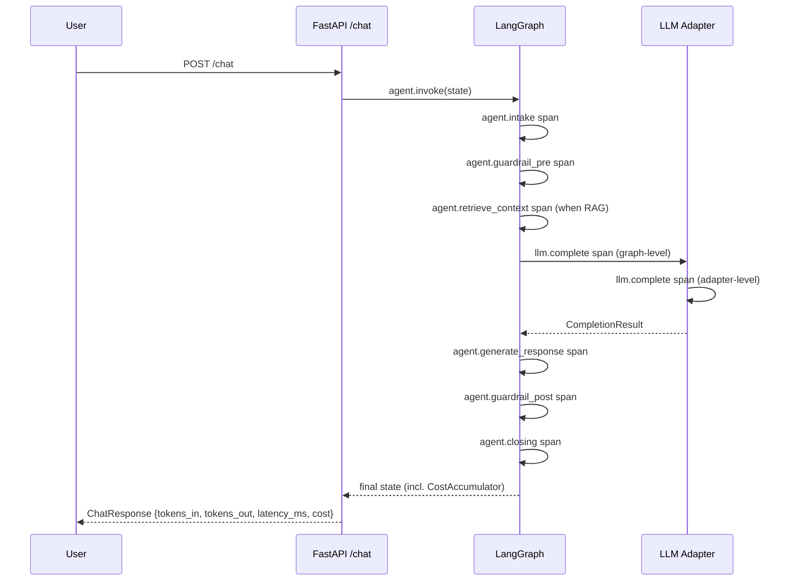

:::caution[Documentación de referencia: no es un dispositivo médico]
Esta documentación describe una implementación de referencia pública evaluada con datos 100% sintéticos. Es una referencia de capacidades y preparación, no una certificación de cumplimiento ni asesoría legal, y no es un dispositivo médico. No está validada clínicamente y no maneja PHI de producción.
:::

# Observabilidad

> Un formato de cable (OpenTelemetry + OpenInference), tres destinos de
> exportación (Langfuse Cloud Hobby, Phoenix autohospedado, OTLP genérico)
> y un acumulador de costo + latencia por turno que aparece en cada
> respuesta de `/chat` y en cada reporte de evaluación. Consulta
> [ADR-0006](../adr/adr-0006-observability.md) para la decisión; este
> archivo es el manual del operador.

## 1. Panorama

El agente emite spans de OpenTelemetry anotados con las convenciones
semánticas de OpenInference. Los spans cubren los nodos de LangGraph
(`agent.intake`, `agent.guardrail_pre`, `agent.retrieve_context`,
`agent.generate_response`, `agent.guardrail_post`, `agent.closing`,
más `agent.review_response` cuando el nodo opcional de HITL está
habilitado) más la llamada al LLM (`llm.complete`). Los conteos de tokens,
la latencia, el nombre del modelo y los conteos de decisiones viajan sobre
los spans como atributos. El texto del mensaje del usuario nunca lo hace.

Tres backends consumen el mismo formato de cable:

- **Langfuse Cloud Hobby** para la **demo en vivo** en Hugging Face
  Spaces. Nivel gratuito: 50K observaciones / mes, retención de 30 días,
  UI hospedada con compartición por enlace público.
- **Phoenix autohospedado** para la **CI de evaluación**. Se levanta a
  través del stack opcional de Docker Compose; sin cuota, sin red externa.
- **OTLP/HTTP genérico** para operadores que ya envían trazas a
  Datadog, Grafana, Honeycomb o cualquier otro stack compatible con OTLP.
  Configurado mediante `OTLP_ENDPOINT`.

Los tres backends están desactivados por defecto. El agente igualmente
produce un `TracerProvider` con un exportador en memoria que descarta los
spans, así que `tracer.start_as_current_span(...)` siempre es seguro de
llamar.

## 2. Formato de cable

El agente usa OpenInference, las convenciones semánticas de Arize para
GenAI. OpenInference se monta sobre OpenTelemetry y agrega atributos
específicos de LLM que el OTel simple no cubre (modelo, proveedor, uso de
tokens, contextos de recuperación, llamadas a herramientas).

La auto-instrumentación para LangChain (cubre LangGraph), OpenAI y
Anthropic se instala cuando el extra opcional `obs` está presente. El
código del agente también emite spans explícitos para cada nodo + cada
llamada al LLM, de modo que el árbol de trazas es legible incluso cuando la
auto-instrumentación está ausente (p. ej., dentro de un proceso de prueba
unitaria).

## 3. Los tres backends

### 3.1 Langfuse Cloud Hobby (demo en vivo)

Predeterminado para la demo en vivo de Hugging Face Spaces.

Regístrate en <https://cloud.langfuse.com>, crea un proyecto, copia las
claves pública + secreta.

```bash
export LANGFUSE_PUBLIC_KEY=pk-lf-...
export LANGFUSE_SECRET_KEY=sk-lf-...
# Optional; defaults to https://cloud.langfuse.com
export LANGFUSE_HOST=https://cloud.langfuse.com
```

Reinicia la API; el lifespan de FastAPI instala un procesador de spans OTLP
ligado a Langfuse sobre el procesador predeterminado. Abre el panel de
Langfuse en `${LANGFUSE_HOST}/project/...` para inspeccionar las trazas.

### 3.2 Phoenix autohospedado (CI de evaluación)

Predeterminado para las corridas de evaluación sin conexión.

```bash
make obs-up
export PHOENIX_OTLP_ENDPOINT=http://localhost:6006/v1/traces
uv run python -m ai_agent_eval.evals run --locale all --with-phoenix
```

Phoenix escucha en `:6006` (UI + OTLP/HTTP) y `:4317` (OTLP/gRPC).
El almacén de trazas persiste en el volumen de Docker `phoenix_data`; baja
el stack con `make obs-down` cuando termines.

### 3.3 OTLP/HTTP genérico

Para operadores que ya tienen un endpoint OTLP.

```bash
export OTLP_ENDPOINT=https://otlp.example.com/v1/traces
```

El lifespan instala un `OTLPSpanExporter` apuntado a esa URL.

### 3.4 Pydantic Logfire (alternativa documentada)

Logfire ofrece un SDK de Python con un nivel gratuito de 10M spans por mes
vigente desde el 2026-01-01. El formato de cable de OpenInference hace que
cambiar a Logfire sea un cambio de configuración, no un cambio de código:
instala `logfire`, configura su exportador OTLP contra
`https://logfire-api.pydantic.dev/v1/traces` y desactiva el procesador de
Langfuse. La distribución no incluye un módulo de backend Logfire de
primera clase; queda a cargo del operador que lo elija.

## 4. Modelo de spans



El agente siempre emite un span `llm.complete` en la capa del grafo.
Los adaptadores reales (Groq, Cerebras, Anthropic) emiten un segundo span
`llm.complete` en la capa del adaptador para la llamada HTTP real. Los
dobles de prueba no poseen un tracer, así que el span de la capa del grafo
mantiene la topología consistente.

El temporizado por nodo también se expone fuera de la canalización de OTel.
El modo de streaming SSE en `/chat` y `/chat/resume` (consulta
[ADR-0010](../adr/adr-0010-streaming-execution-graph.md)) emite un evento
`node_started` y un evento `node_completed` por cada nodo ejecutado, donde
el `node_completed` lleva un `duration_ms` medido por el emisor: el
intervalo de reloj de pared entre los eventos de inicio y fin del nodo para
el id de corrida coincidente. Esa cifra se mide de forma independiente de
los spans de OTel anteriores (no es una duración de span de traza) y
alimenta el Grafo de Ejecución del Agente de la demo; los spans de OTel
siguen siendo el registro de observabilidad autoritativo exportado a
Langfuse y Phoenix.

## 5. Qué se registra (y qué NO)

Cada span lleva ÚNICAMENTE METADATOS:

- `service.name`, `service.namespace=healthtech-demo`,
  `service.version`, `deployment.environment`
- `agent.node` (uno de `intake / guardrail_pre / retrieve_context /
  generate_response / guardrail_post / closing`)
- `agent.tokens_in`, `agent.tokens_out`, `agent.latency_ms`
- `agent.guardrail_decisions_count`, `agent.citations_count`
- `llm.provider` (`groq` / `cerebras` / `anthropic`), `llm.model`,
  `llm.tokens_in`, `llm.tokens_out`, `llm.latency_ms`,
  `llm.finish_reason`

**Ningún atributo de span lleva el texto del mensaje del usuario, el texto
de la respuesta del asistente ni ninguna PHI.** Esto lo impone una prueba
unitaria dedicada que verifica el invariante de privacidad. Violar este
invariante implica una puerta de CI fallida. La motivación es la
[postura regulatoria](regulatory-posture.md): las trazas salen del proceso
local; los mensajes del usuario no deben salir.

Si necesitas inspeccionar una transcripción, hazlo desde los registros de
FastAPI en el entorno de confianza, NO desde el almacén de trazas. El
trabajo futuro podría agregar una perilla opcional `trace.include_content=True`
con reconocimiento explícito del operador; hoy la respuesta es "no".

## 6. Presupuestos de costo y latencia

Los presupuestos por turno viven en la configuración de la aplicación:

| Configuración | Predeterminado | Variable de entorno |
| --- | --- | --- |
| `cost_budget_tokens_in_per_turn` | 4000 | `COST_BUDGET_TOKENS_IN_PER_TURN` |
| `cost_budget_tokens_out_per_turn` | 1000 | `COST_BUDGET_TOKENS_OUT_PER_TURN` |
| `cost_budget_latency_ms_per_turn` | 8000 | `COST_BUDGET_LATENCY_MS_PER_TURN` |

El ejecutor de evaluación compara los números promedio por turno del corpus
contra estos presupuestos. La puerta de costo es **estricta y bloqueante de
PR** por defecto: la CLI de evaluación sale con código distinto de cero
cuando el promedio del corpus por turno supera cualquier presupuesto, y el
reporte legible lleva una tabla de estado por dimensión y una línea resuelta
`[cost-gate=PASS|WARN|FAIL|off]` bajo la sección "Cost & latency". Pasa
`--cost-gate warn` para un comportamiento de solo advertencia o
`--cost-gate off` para suprimir por completo la representación del costo.
Como válvula de escape sin claves, la puerta estricta se degrada
automáticamente a solo advertencia cuando no hay una clave de proveedor
capaz de actuar como juez, de modo que un PR sin claves no puede fallar por
costo.

Para sobrescribir los valores predeterminados del presupuesto, configura
las variables de entorno (un archivo `.env` funciona igual que las claves
de LLM).

## 7. Inicio rápido local

```bash
# 1. Boot the optional observability stack (Phoenix).
make obs-up

# 2. Wire the eval CLI to ship traces to Phoenix.
export PHOENIX_OTLP_ENDPOINT=http://localhost:6006/v1/traces
uv run python -m ai_agent_eval.evals run \
  --locale all \
  --with-phoenix \
  --report-dir evals/reports

# 3. Open the Phoenix UI.
#    http://localhost:6006
```

Para la API en vivo + Langfuse:

```bash
export LANGFUSE_PUBLIC_KEY=pk-lf-...
export LANGFUSE_SECRET_KEY=sk-lf-...
uv run uvicorn ai_agent_eval.api.main:app --reload
# Open https://cloud.langfuse.com/project/<id>/traces
```

## 8. Tope del nivel gratuito

Langfuse Cloud Hobby se limita a **50K observaciones / mes** sin
facturación por excedente; el tráfico que supere el tope se descarta en
silencio. Esto es intencional: la URL de la demo en vivo mantiene una
garantía de costo de `$0 / mes`.

Cuando se alcanza el tope, las opciones son:

1. **Dejar de enviar trazas** a Langfuse: desconfigura
   `LANGFUSE_PUBLIC_KEY` / `LANGFUSE_SECRET_KEY` y vuelve a desplegar.
2. **Cambiar a Logfire** (10M spans/mes gratis): consulta §3.4.
3. **Actualizar Langfuse** a Pro (nivel pago).
4. **Autohospedar Langfuse** a través del servicio comentado en el stack
   opcional de Docker Compose.

Para la ruta de CI de evaluación, el backend Phoenix autohospedado no tiene
tope de cuota sobre el almacenamiento de trazas; la restricción operativa
allí es la puerta de costo estricta y bloqueante de PR (§6), no una cuota
de observaciones.

## 9. Modos de falla

| Síntoma | Causa probable | Solución |
| --- | --- | --- |
| No hay spans en Langfuse | Claves sin configurar o host equivocado | Vuelve a revisar las variables de entorno |
| `make obs-up` da errores | El daemon de Docker no está corriendo | Inicia Docker |
| UI de Phoenix vacía | `PHOENIX_OTLP_ENDPOINT` sin configurar en el productor | Exporta la variable de entorno antes de correr la evaluación |
| `make eval` se cuelga > 10 s | El exportador OTLP está bloqueado en un endpoint faltante | Desconfigura los endpoints OTLP / reinicia la evaluación |
| Falta el reporte de costo | Las unidades de costo nunca se registraron | El grafo agrega unidades de costo desde el nodo de generación; verifica contra la ruta de prueba del reporte de costo |
