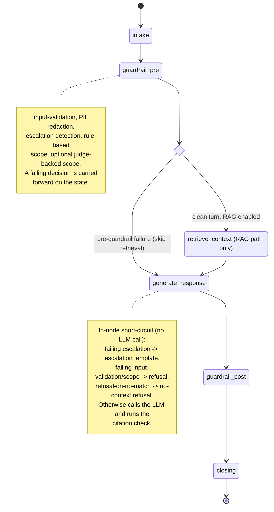
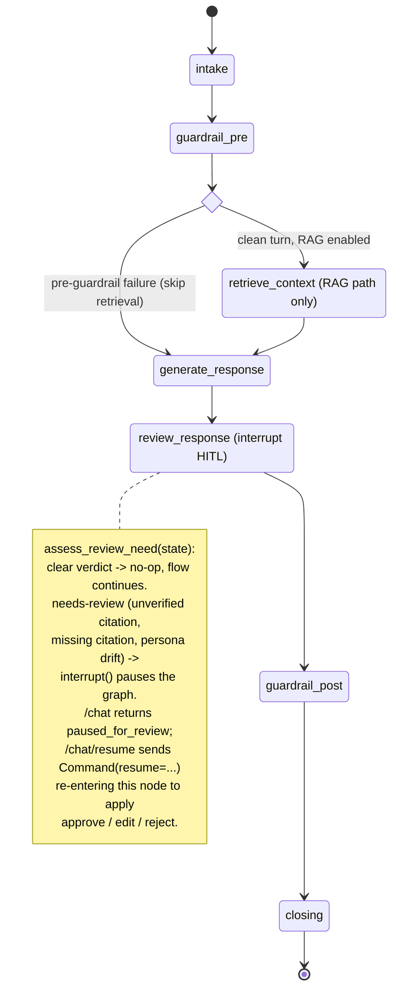

:::caution[Documentação de referência: não é um dispositivo médico]
Esta documentação descreve uma implementação de referência pública avaliada com dados 100% sintéticos. É uma referência de capacidades e prontidão, não uma certificação de conformidade nem aconselhamento jurídico, e não é um dispositivo médico. Não é clinicamente validada e não manipula PHI de produção.
:::

# Máquina de estados do agente

O `StateGraph` do LangGraph para o agente de adesão à medicação. O agente é
um pipeline curto e majoritariamente linear de nós do grafo, não uma máquina
conversacional multiestado: um turno de `/chat` flui por ele uma única vez.

O build padrão tem seis nós:
`intake -> guardrail_pre -> [retrieve_context] -> generate_response ->
guardrail_post -> closing`. `retrieve_context` existe apenas quando tanto um
armazenamento vetorial quanto um embedder são injetados (o caminho RAG); sem
nenhum dos dois, o grafo degrada para um formato de três nós (`intake ->
guardrail_pre -> generate_response -> guardrail_post -> closing`, sem
recuperação).

Existem dois pontos de ramificação reais:

- Uma aresta condicional após `guardrail_pre` pula `retrieve_context` e
  roteia diretamente para `generate_response` sempre que `guardrail_pre` já
  anexou uma decisão de pré-guardrail de falha (validação de entrada,
  escopo ou escalação). O turno rejeitado nunca usaria o contexto
  recuperado, então fazer seu embedding é pulado (sem chamada cobrável ao
  embedder desperdiçada).
- `generate_response` faz curto-circuito na chamada ao LLM para um template
  determinista em três condições: uma decisão de escalação de falha (emite o
  template de escalação ciente do idioma), uma decisão de falha de validação
  de entrada / escopo (emite uma recusa ciente do idioma) ou uma decisão de
  `refusal-on-no-match` vinda de `retrieve_context` (emite a recusa de
  contexto ausente). Essas são ramificações dentro do nó, não arestas do
  grafo; um turno em curto-circuito ainda flui por cada nó subsequente.

Quando o grafo é construído com HITL habilitado, um nó `review_response` é
inserido entre `generate_response` e `guardrail_post`. Ele chama
`assess_review_need` (uma função pura, determinista e total sobre as
decisões de guardrail); quando um rascunho de alto risco mas não agudo é
detectado (citação não verificada, citação ausente em um turno RAG ou desvio
de persona), ele chama o `interrupt()` do LangGraph para pausar o grafo à
espera da aprovação humana. O handler de `/chat` retorna
`status="paused_for_review"`; o humano retoma por meio de
`POST /chat/resume`, que entrega um `Command(resume=...)` que reentra em
`review_response` e aplica a decisão (aprovar / editar / rejeitar). Um
veredito `clear` torna o nó um no-op e o grafo segue exatamente como o grafo
de seis nós faz. Sinais de alerta agudos nunca alcançam essa pausa: eles
sofrem curto-circuito antes, em `guardrail_pre`.

Consulte [ADR-0001](../adr/adr-0001-orchestration.md) para a justificativa
da orquestração, [c4-component.md](./c4-component.md) para a decomposição em
nós e módulos, e [request-sequence.md](./request-sequence.md) para o fluxo
de interação de turno único.

O Grafo de Execução do Agente na single-page app de demonstração
([ADR-0010](../adr/adr-0010-streaming-execution-graph.md))
é uma visualização ao vivo, no navegador, dessa mesma topologia: ele desenha
o conjunto real de nós e arestas compilados mostrado abaixo e acende cada nó
conforme um turno é transmitido. O caminho de emissão por streaming e a
visualização não alteraram o grafo do agente, então este diagrama permanece
a referência de topologia autoritativa e o grafo ao vivo deve corresponder a
ele.

## Grafo de nós (build padrão)

## Grafo de nós com HITL habilitado

