:::caution[Documentação de referência: não é um dispositivo médico]
Esta documentação descreve uma implementação de referência pública avaliada com dados 100% sintéticos. É uma referência de capacidades e prontidão, não uma certificação de conformidade nem aconselhamento jurídico, e não é um dispositivo médico. Não é clinicamente validada e não manipula PHI de produção.
:::

# Componentes C4 - Runtime do agente LangGraph

A visão de componentes decompõe o contêiner `LangGraph Agent Runtime`
(consulte [c4-container.md](/ai-agent-eval-harness-healthtech-docs/pt-br/diagrams/c4-container/)) nos componentes que um único
turno de `/chat` de fato executa: os nós do grafo e os módulos de guardrail
de primeira classe que esses nós invocam.

O app FastAPI entra no grafo por uma de duas APIs de grafo, selecionada por
negociação de conteúdo em `/chat` e `/chat/resume`: `ainvoke` para uma
requisição JSON simples e `astream` para uma requisição
`Accept: text/event-stream`, cujos eventos por nó o app FastAPI mapeia para
um fluxo de server-sent-events que conduz o Grafo de Execução do Agente ao
vivo na single-page app. O endpoint somente leitura `GET /graph/topology`
retorna o conjunto de nós e as arestas do grafo compilado como JSON, lidos a
partir do mesmo grafo compilado, para que a SPA possa desenhar o grafo em
estado ocioso antes do primeiro turno. Nenhuma das duas adições altera o
conjunto de nós nem o fluxo de controle abaixo.

O agente é um `StateGraph` de seis nós (`intake -> guardrail_pre ->
[retrieve_context] -> generate_response -> guardrail_post -> closing`), com
`retrieve_context` presente apenas no caminho RAG e um nó opcional
`review_response` de HITL inserido entre `generate_response` e
`guardrail_post` quando o HITL está habilitado. Os guardrails não são uma
camada orquestrada separada - são módulos chamados de dentro de três nós:

- `guardrail_pre` chama `input_validation`, `pii`, `escalation` e o
  classificador `scope` baseado em regras (e opcionalmente apoiado por
  juiz). Uma decisão de falha é levada adiante no estado.
- `generate_response` lê essas decisões para decidir se deve fazer
  curto-circuito para uma saída determinista de `refusal` ou
  `escalation_templates`; no caminho de geração, chama `citations` para
  extrair e verificar marcadores `[cite:ID]`.
- `guardrail_post` chama `citations` (a verificação de citação ausente) e
  `persona` (estabilidade de persona). Ambos são apenas sinalização e nunca
  bloqueiam.
- `review_response` (somente HITL) chama `assess_review_need`, que reutiliza
  `citations` e `persona`, e renderiza um template de HITL rejeitado em caso
  de rejeição. Ele chama o `interrupt()` do LangGraph para pausar à espera
  da aprovação humana.

Consulte [agent-state-machine.md](/ai-agent-eval-harness-healthtech-docs/pt-br/diagrams/agent-state-machine/) para o fluxo de
controle e [ADR-0005](/ai-agent-eval-harness-healthtech-docs/pt-br/adr/adr-0005-guardrails/) para o design dos
guardrails.

```mermaid
C4Component
  title Component View - LangGraph Agent Runtime

  Container(api, "FastAPI App", "Python, FastAPI", "Runs the compiled graph via ainvoke (JSON) or astream (SSE); serves the read-only /graph/topology")
  ContainerDb(rag, "RAG Store", "Chroma embedded", "36 synthetic KB cards")
  Container(llm_client, "LLMClient Adapters", "Python", "OpenAI / Anthropic / Groq / Cerebras")
  ContainerDb(saver, "Checkpointer", "MemorySaver / AsyncPostgresSaver", "Persists paused HITL state")

  Container_Boundary(runtime, "LangGraph Agent Runtime") {
    Component(intake, "intake", "graph node", "Mints the trace id, increments the turn index")
    Component(gpre, "guardrail_pre", "graph node", "Runs the pre-generation guardrail checks in order")
    Component(retrieve, "retrieve_context", "graph node (RAG path)", "Embeds the user turn, queries the KB; flags refusal-on-no-match")
    Component(generate, "generate_response", "graph node", "Short-circuits on a failing decision, else calls the LLM and verifies citations")
    Component(review, "review_response", "graph node (HITL only)", "assess_review_need; interrupt() pauses high-risk drafts for human sign-off")
    Component(gpost, "guardrail_post", "graph node", "Missing-citation check and persona-stability check (flag-only)")
    Component(closing, "closing", "graph node", "Finalises the turn")
  }

  Container_Boundary(guardrails, "Guardrail Modules") {
    Component(input_validation, "input_validation", "module", "Refuses empty, oversized, or non-printable input")
    Component(pii, "pii", "module", "Deterministic PII redaction; optional LLM recheck")
    Component(scope, "scope", "module", "Rule-based and optional judge-backed scope classifier")
    Component(escalation, "escalation", "module", "Versioned red-flag regex; emits a structured escalation decision")
    Component(citations, "citations", "module", "Extracts and verifies [cite:ID]; missing-citation check")
    Component(persona, "persona", "module", "Persona-stability drift detection")
    Component(refusal, "refusal / escalation_templates", "modules", "Locale-aware refusal and escalation template renderers")
    Component(reviewmod, "review", "module", "assess_review_need verdict; render_hitl_rejected template")
  }

  Rel(api, intake, "ainvoke / astream enters the graph at")
  Rel(intake, gpre, "then")
  Rel(gpre, retrieve, "clean turn, RAG enabled")
  Rel(gpre, generate, "pre-guardrail failure (skips retrieval)")
  Rel(retrieve, generate, "then")
  Rel(generate, review, "then (HITL enabled)")
  Rel(generate, gpost, "then (HITL disabled)")
  Rel(review, gpost, "then")
  Rel(gpost, closing, "then")

  Rel(gpre, input_validation, "validates with")
  Rel(gpre, pii, "redacts with")
  Rel(gpre, escalation, "detects red flags with")
  Rel(gpre, scope, "classifies scope with")
  Rel(retrieve, rag, "queries")
  Rel(generate, llm_client, "generates with")
  Rel(generate, citations, "verifies citations with")
  Rel(generate, refusal, "renders short-circuit output with")
  Rel(gpost, citations, "missing-citation check with")
  Rel(gpost, persona, "checks persona drift with")
  Rel(review, reviewmod, "assesses review need with")
  Rel(review, saver, "persists paused state to")

  UpdateLayoutConfig($c4ShapeInRow="3", $c4BoundaryInRow="1")
```

