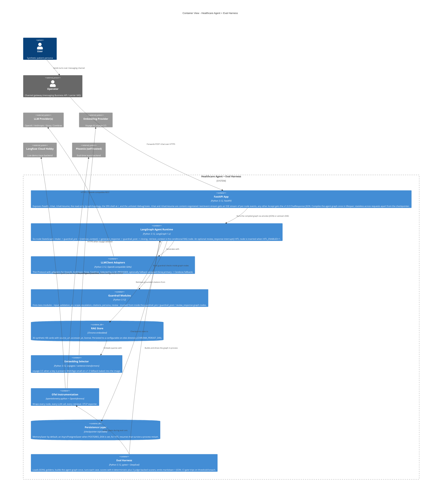

:::caution[Documentação de referência: não é um dispositivo médico]
Esta documentação descreve uma implementação de referência pública avaliada com dados 100% sintéticos. É uma referência de capacidades e prontidão, não uma certificação de conformidade nem aconselhamento jurídico, e não é um dispositivo médico. Não é clinicamente validada e não manipula PHI de produção.
:::

# Contêineres C4 - `ai-agent-eval-harness-healthtech`

A visão de contêineres decompõe o sistema do agente em unidades
implantáveis. Um app FastAPI fica à frente da superfície pública
(`/health`, `/chat`, `/chat/resume` e o `/graph/topology` somente leitura)
mais a casca de single-page app em `/`; não há endpoint `/metrics`. `/chat`
e `/chat/resume` usam negociação de conteúdo: uma requisição
`Accept: text/event-stream` recebe um fluxo de server-sent-events com
eventos de execução por nó, qualquer outro `Accept` recebe o JSON estável
`ChatResponse`. O runtime do agente LangGraph é dono do pipeline
conversacional: o grafo de seis nós `intake -> guardrail_pre ->
[retrieve_context] -> generate_response -> guardrail_post -> closing`, com
um nó opcional `review_response` de human-in-the-loop (HITL) inserido entre
`generate_response` e `guardrail_post` quando o HITL está habilitado. Os
módulos de guardrail rodam dentro dos nós do grafo (`guardrail_pre` e
`guardrail_post`), não como uma camada orquestrada separada. O
armazenamento RAG é Chroma embarcado, fundamentado em uma KB sintética de
36 cartões. O arnês de avaliação roda fora do processo, construindo o mesmo
grafo. A instrumentação OpenTelemetry conecta cada nó aos backends de
observabilidade.

O grafo é compilado uma vez quando o app FastAPI inicia e é reutilizado
entre requisições. A camada de persistência é injetável por checkpointer:
um checkpointer em memória por padrão, ou um checkpointer durável apoiado em
Postgres quando uma string de conexão de banco de dados é configurada (o
caminho durável para retomadas de HITL que atravessam um reinício de
processo). Consulte
[ADR-0001](/ai-agent-eval-harness-healthtech-docs/pt-br/adr/adr-0001-orchestration/) para a justificativa.

O armazenamento RAG usa recuperação híbrida: correspondência léxica BM25
mais vetores densos (BAAI BGE) mais um reordenamento por cross-encoder,
fundidos via fusão recíproca de ranques (RRF), sobre cartões da KB
fragmentados semanticamente com recuperação de documento-pai. O arnês de
avaliação pontua cada caso com quatro pontuadores deterministas sempre
ativos mais três pontuadores apoiados por juiz; o modelo juiz é o Cerebras
`gpt-oss-120b`. Uma violação de limiar aciona a barreira de CI.
