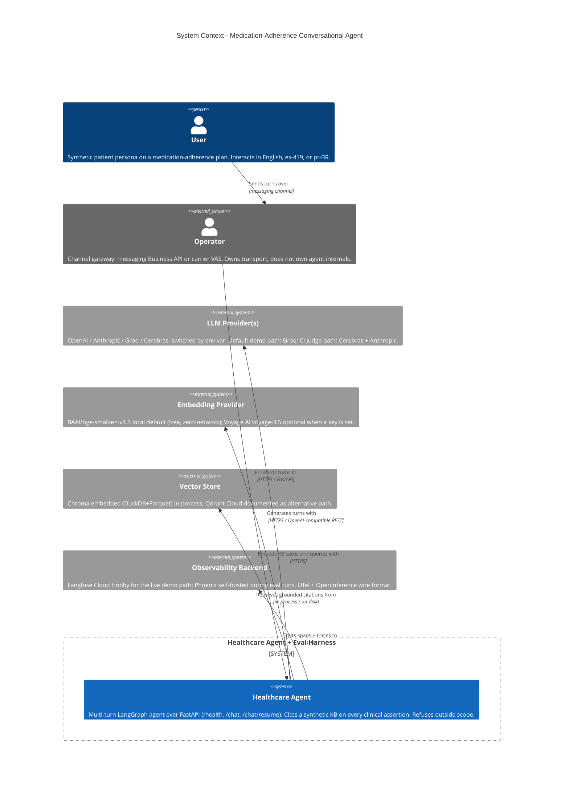

:::caution[Documentação de referência: não é um dispositivo médico]
Esta documentação descreve uma implementação de referência pública avaliada com dados 100% sintéticos. É uma referência de capacidades e prontidão, não uma certificação de conformidade nem aconselhamento jurídico, e não é um dispositivo médico. Não é clinicamente validada e não manipula PHI de produção.
:::

# Contexto C4 - `ai-agent-eval-harness-healthtech`

A visão de contexto mostra o limite do sistema do agente conversacional de
adesão à medicação e os sistemas externos dos quais ele depende. O sistema
é exercitado por um Usuário (persona de paciente sintético) e integrado por
um Operador (um gateway de canal genérico - por exemplo, uma API de
mensagens para empresas ou uma superfície de serviço de valor agregado de
uma operadora). As dependências técnicas externas são divididas em
provedores de LLM, um provedor de embeddings, o armazenamento vetorial e
um backend de observabilidade.

Consulte também [c4-container.md](/ai-agent-eval-harness-healthtech-docs/pt-br/diagrams/c4-container/) para a decomposição do
próximo nível.

O caminho de recuperação usa por padrão um modelo local de embeddings
densos (BAAI BGE); o provedor de embeddings do diagrama também reflete uma
alternativa documentada de embeddings hospedados. Os vetores densos são
combinados com a correspondência léxica BM25 e um reordenamento por
cross-encoder, fundidos via fusão recíproca de ranques (RRF), de modo que
cada citação fundamentada provém do recuperador híbrido.
