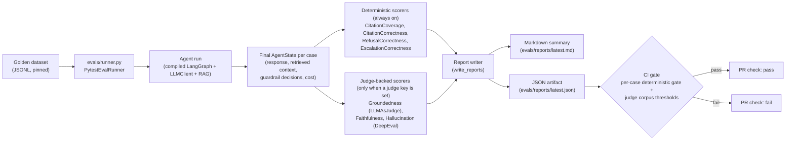

:::caution[Documentação de referência: não é um dispositivo médico]
Esta documentação descreve uma implementação de referência pública avaliada com dados 100% sintéticos. É uma referência de capacidades e prontidão, não uma certificação de conformidade nem aconselhamento jurídico, e não é um dispositivo médico. Não é clinicamente validada e não manipula PHI de produção.
:::

# Pipeline de avaliação

O arnês de avaliação lê um conjunto de dados golden JSONL fixado, executa
cada caso de ponta a ponta no mesmo agente LangGraph compilado que o caminho
de produção usa (ele constrói o grafo uma vez por execução, com HITL
desligado), despacha cada estado final do agente para um conjunto componível
de pontuadores e emite tanto um resumo em markdown quanto um artefato JSON. A
barreira de CI consome o artefato JSON; uma falha determinista por caso ou
uma violação de limiar de corpus apoiada por juiz produz um código de saída
diferente de zero e faz falhar a verificação do PR.

A execução padrão do runner usa dois grupos de pontuadores:

- Pontuadores deterministas sempre ativos (sem LLM, sem chave necessária)
  condicionam cada PR: `CitationCoverageScorer`, `CitationCorrectnessScorer`,
  `RefusalCorrectnessScorer`, `EscalationCorrectnessScorer`.
- Pontuadores apoiados por juiz se anexam apenas quando um cliente juiz é
  fornecido (uma chave de API da Cerebras está configurada):
  `GroundednessScorer` (via `LLMAsJudge` diretamente), `FaithfulnessScorer` e
  `HallucinationScorer` (via `FaithfulnessMetric` / `HallucinationMetric` do
  DeepEval). Sem uma chave de juiz, a execução reporta o juiz como
  desabilitado e a barreira de limiar roda apenas contra os pontuadores
  deterministas. O modelo juiz é o Cerebras `gpt-oss-120b`.

Consulte [ADR-0003](/ai-agent-eval-harness-healthtech-docs/pt-br/adr/adr-0003-eval-harness/) para a política de
limiares e [ADR-0009](/ai-agent-eval-harness-healthtech-docs/pt-br/adr/adr-0009-judge-model-cerebras/) para a escolha
do modelo juiz.

