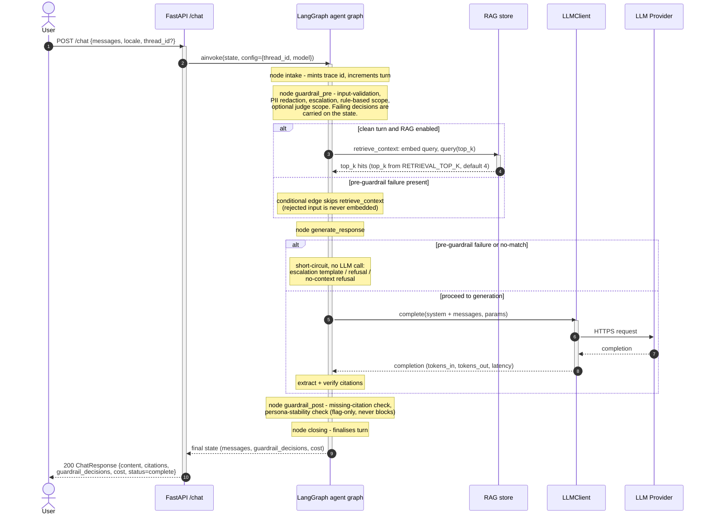
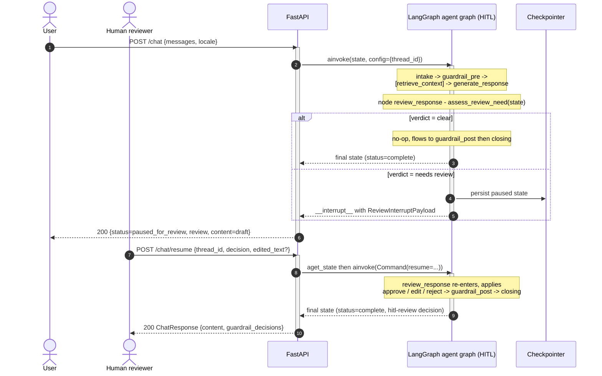

:::caution[Documentação de referência: não é um dispositivo médico]
Esta documentação descreve uma implementação de referência pública avaliada com dados 100% sintéticos. É uma referência de capacidades e prontidão, não uma certificação de conformidade nem aconselhamento jurídico, e não é um dispositivo médico. Não é clinicamente validada e não manipula PHI de produção.
:::

# Sequência de requisição - Um turno

A sequência de interações que trata um único turno do usuário através de
`POST /chat`. O handler FastAPI executa o turno no grafo LangGraph
compilado; qual API de grafo ele usa depende da negociação de conteúdo. Uma
requisição JSON simples (qualquer `Accept` que não seja `text/event-stream`)
é executada via `ainvoke` e retorna um `ChatResponse`. Uma requisição que
carrega `Accept: text/event-stream` é executada via `astream` e retorna um
fluxo de server-sent-events com eventos de execução por nó; o Grafo de
Execução do Agente na single-page app de demonstração consome esse fluxo. A
variante de streaming é a segunda sequência abaixo. De qualquer forma, os
guardrails não são uma camada que a API orquestra em torno do grafo - eles
rodam *como nós do grafo*. `guardrail_pre` roda depois de `intake`;
`guardrail_post` roda depois de `generate_response`. Uma decisão de
pré-guardrail de falha é levada adiante no estado e faz curto-circuito na
chamada ao LLM dentro de `generate_response`; o turno ainda flui por cada nó
subsequente, então até um turno de recusa ou de sem correspondência volta
como uma mensagem do assistente no estado final do grafo. Spans do
OpenTelemetry são abertos em cada nó e ao redor da chamada ao LLM.

Consulte [c4-container.md](/ai-agent-eval-harness-healthtech-docs/pt-br/diagrams/c4-container/) para a decomposição estática e
[c4-component.md](/ai-agent-eval-harness-healthtech-docs/pt-br/diagrams/c4-component/) para a visão de nós e módulos.

## Turno único concluído



## Pausa e retomada de HITL

Quando o grafo é compilado com HITL habilitado, um nó `review_response` fica
entre `generate_response` e `guardrail_post`. Um rascunho de alto risco mas
não agudo pausa o grafo via `interrupt()` do LangGraph; o turno é retomado
por uma chamada separada `POST /chat/resume`.



## Turno por streaming (`Accept: text/event-stream`)

Quando a requisição pede `text/event-stream`, o handler conduz o mesmo grafo
compilado através de `astream` em vez de `ainvoke` e mapeia cada evento
por nó do LangGraph para um registro de server-sent-events. O fluxo abre com
um evento `graph_topology` (para que a SPA desenhe o conjunto real de nós
antes que qualquer nó rode), depois emite um par `node_started` /
`node_completed` por nó executado e um `node_completed` `skipped`
sintetizado por nó condicional genuinamente ignorado, e termina com um
evento terminal `turn_completed` carregando o `ChatResponse` completo. Uma
falha após o primeiro byte é um evento `error` dentro do fluxo; uma falha
antes do primeiro byte é um erro HTTP normal. Consulte
[ADR-0010](/ai-agent-eval-harness-healthtech-docs/pt-br/adr/adr-0010-streaming-execution-graph/) para o schema de
eventos.

```mermaid
sequenceDiagram
  autonumber

  actor Client as SSE client (demo SPA)
  participant API as FastAPI /chat
  participant Graph as LangGraph agent graph

  Client->>API: POST /chat (Accept: text/event-stream)
  activate API
  Note over API: content negotiation selects the SSE path;<br/>build the graph_topology payload before streaming
  API-->>Client: 200 text/event-stream (Cache-Control: no-cache,<br/>X-Accel-Buffering: no)
  API-->>Client: event: graph_topology (real node set + edges + flags)
  API->>Graph: astream(state, config={thread_id, model})
  activate Graph

  loop per executed node, in graph order
    Graph-->>API: node lifecycle event
    API-->>Client: event: node_started {node, run_id, ts_ms}
    Note over Graph: node body runs (guardrails / retrieval /<br/>generation), spans opened as in the JSON path
    Graph-->>API: node lifecycle event
    API-->>Client: event: node_completed {node, status=executed,<br/>duration_ms}
  end

  opt a conditional node was genuinely bypassed
    Note over API: diff topology vs nodes that emitted events
    API-->>Client: event: node_completed {status=skipped,<br/>duration_ms=0}
  end

  Graph-->>API: final state
  deactivate Graph
  API-->>Client: event: turn_completed { ...full ChatResponse... }
  deactivate API
```

Um turno HITL por streaming encerra seu fluxo de `/chat` com um evento
`paused` (carregando o `ReviewInterruptPayload`) em vez de `turn_completed`,
e fecha; o turno continua em um novo fluxo SSE `POST /chat/resume` que abre
com seu próprio evento `graph_topology`, reemite os nós pós-pausa e termina
com `turn_completed` carregando um `human_wait_ms` no nível do envelope.
