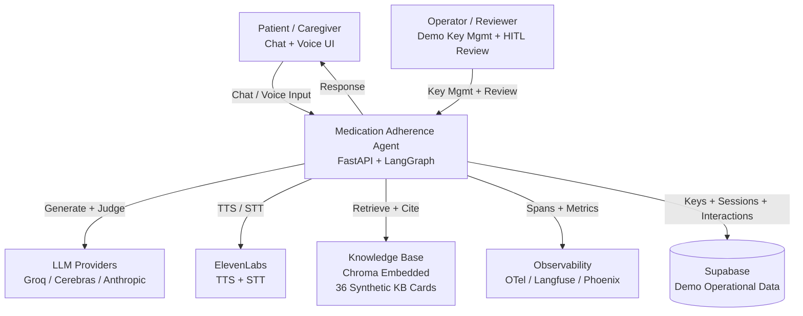
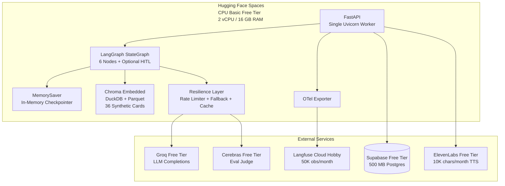
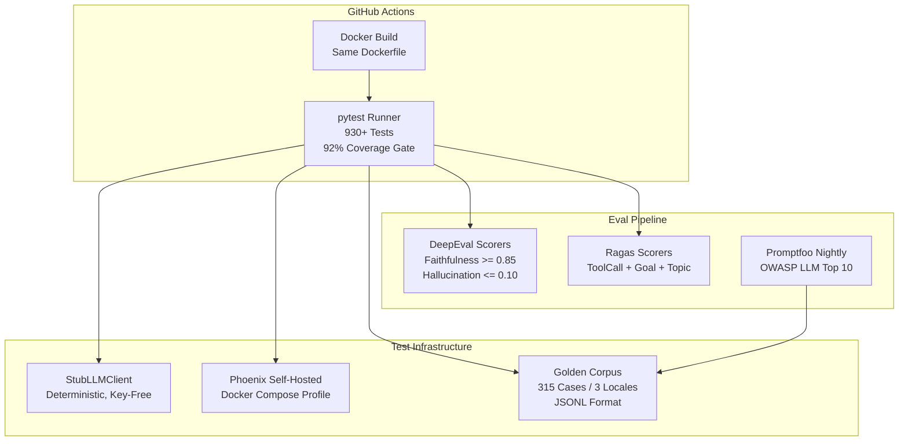
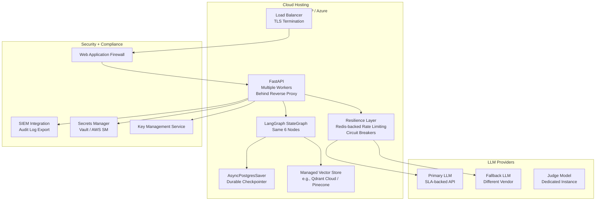
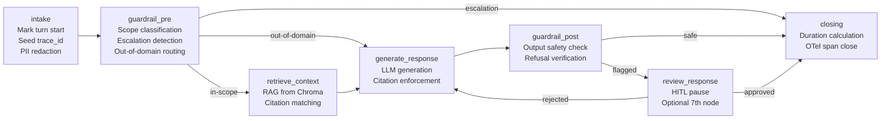

:::caution[Documentação de referência: não é um dispositivo médico]
Esta documentação descreve uma implementação de referência pública avaliada com dados 100% sintéticos. É uma referência de capacidades e prontidão, não uma certificação de conformidade nem aconselhamento jurídico, e não é um dispositivo médico. Não é clinicamente validada e não manipula PHI de produção.
:::

# Pilha empresarial do agente: demonstração vs referência de produção

## Propósito

Este documento mapeia a lacuna entre a atual implementação de referência da demonstração e o que uma implantação de produção exigiria. Ele serve a operadores que planejam adaptar a demonstração em uma implantação real, e a leitores que avaliam a consciência de produção da implementação de referência.

A arquitetura é apresentada em cinco camadas (Computação/Hospedagem, Armazenamento/Dados, IA/ML, Observabilidade, Segurança/Conformidade) usando diagramas Mermaid para clareza visual.

## Escopo

Isto cobre o agente conversacional de adesão à medicação conforme implantado no Hugging Face Spaces, o pipeline de CI/avaliação e uma arquitetura de referência de produção genérica. Não prescreve um fornecedor de nuvem específico; a referência de produção identifica o que uma implantação real precisaria, não qual fornecedor usar.

---

## 1. Diagrama de Contexto do Sistema

A visão de mais alto nível: quem usa o sistema, de quais sistemas externos ele depende e quais dados fluem entre eles.

**Limites-chave:**

- O agente é o único limite de confiança. Toda entrada do usuário entra através do FastAPI e passa pelo pipeline de salvaguardas antes de alcançar qualquer sistema externo.
- Os provedores de LLM, o ElevenLabs e os sinks de observabilidade são dependências externas. O agente degrada graciosamente quando qualquer um deles está indisponível.
- O Supabase armazena dados operacionais (chaves da demo, interações, sugestões de melhoria), mas o agente continua servindo turnos se ele estiver fora do ar.

---

## 2. Diagramas de Contêiner

Três contextos de implantação: a demonstração ao vivo, o pipeline de CI/avaliação e uma referência de produção.

### 2.1 Contêiner da demonstração (atual -- $0/mês)

**Custo: $0/mês** em todos os serviços. A camada gratuita de cada provedor cobre o tráfego em escala de demonstração (50-150 revisores, 5-10 turnos cada). O arranque a frio é de 10-30 segundos após 48 horas de inatividade.

### 2.2 Contêiner de CI/avaliação

**Garantia de determinismo:** O gate de CI passa sem chave por meio de um cliente LLM stub determinístico. Os scorers apoiados em juiz só são ativados quando uma chave da Cerebras está definida. A mesma imagem Docker que passa no CI é a imagem que é entregue ao HF Spaces.

### 2.3 Contêiner de referência de produção

**Lacuna de produção:** A demonstração roda em um único worker de camada gratuita com estado em memória. A produção precisa de balanceamento de carga, persistência durável, segredos gerenciados, WAF, SIEM e provedores de LLM com SLA. A arquitetura é a mesma (StateGraph de seis nós do LangGraph) -- apenas as camadas de infraestrutura mudam.

---

## 3. Diagrama de Componentes: internos do grafo do agente

O StateGraph de seis nós do LangGraph com o sétimo nó HITL opcional.

**Fluxo de dados:**

1. **intake** -- marca o início do turno, semeia o trace ID, aplica a redação de PII.
2. **guardrail_pre** -- executa o classificador de escopo. Mensagens dentro de escopo seguem para a recuperação RAG. Mensagens fora de domínio contornam a recuperação e recebem um fallback gracioso. Mensagens que disparam escalonamento curto-circuitam para o closing com um encaminhamento.
3. **retrieve_context** -- consulta o Chroma embedded por cartões de KB relevantes. Se nenhum cartão corresponder, o agente recusa em vez de alucinar.
4. **generate_response** -- chama o provedor de LLM configurado com o contexto recuperado e um prompt que impõe citação.
5. **guardrail_post** -- verifica que a resposta gerada não contém dosagem, diagnóstico ou outro conteúdo fora de escopo. Respostas sinalizadas são roteadas para a revisão HITL.
6. **closing** -- calcula a duração do turno, fecha o span OTel e retorna a resposta.
7. **review_response** (opcional) -- uma interrupção do LangGraph para revisão human-in-the-loop de turnos sinalizados. Desabilitado por padrão no modo de avaliação.

---

## 4. Comparação em cinco camadas: demonstração vs produção

| Camada | Demonstração (atual) | Referência de produção |
|-------|---------------|---------------------|
| **Computação/Hospedagem** | HF Spaces CPU Basic camada gratuita; único worker uvicorn; 2 vCPU / 16 GB RAM; dorme após 48h de inatividade; arranque a frio de 10-30s | Hospedagem em nuvem (AWS/GCP/Azure); múltiplos workers atrás de balanceador de carga; auto-escalonamento; implantações sem tempo de inatividade; uptime com SLA |
| **Armazenamento/Dados** | Chroma embedded (DuckDB+Parquet) para RAG; `MemorySaver` em memória para o estado da conversa; Supabase camada gratuita (500 MB) para dados operacionais da demo | Armazenamento vetorial gerenciado (Qdrant Cloud / Pinecone) para RAG; `AsyncPostgresSaver` para estado durável da conversa; Postgres gerenciado (RDS / Cloud SQL) com backups para dados operacionais; criptografia de dados em repouso |
| **IA/ML** | Groq camada gratuita para completamentos de LLM; Cerebras camada gratuita para o juiz de avaliação; BAAI/bge-small-en-v1.5 para embeddings; cliente LLM stub determinístico para CI; cartões de KB sintéticos | API de LLM com SLA e throughput dedicado; modelo de juiz ajustado; serviço de embedding gerenciado; base de conhecimento expandida com revisão clínica; avaliação contínua com detecção de drift |
| **Observabilidade** | Spans OTel com convenções OpenInference; Langfuse Cloud Hobby (50K obs/mês); Phoenix auto-hospedado em Docker para execuções de avaliação; exportação OTLP | Pilha OTel completa com collector, amostragem e políticas de retenção; backend de observabilidade dedicado (Datadog / Grafana / Honeycomb); alertas sobre latência, taxa de erro e anomalias de custo; exportação de log de auditoria para SIEM |
| **Segurança/Conformidade** | Sem segredos no repositório (gitleaks no CI); lockfile fixado; Dependabot habilitado; sem PHI / sem EHR real; enquadramento de General Wellness da FDA; redação de PII na entrada | WAF / proteção contra DDoS; segredos gerenciados (Vault / AWS Secrets Manager); BAA com todos os provedores de LLM; conformidade com a HIPAA Security Rule; SOC 2 Type II; testes de penetração; plano de resposta a incidentes |

---

## 5. Detalhes das camadas

### 5.1 Computação/Hospedagem

**Estado atual.** A demonstração roda no Hugging Face Spaces CPU Basic camada gratuita. Um único worker uvicorn serve todas as requisições. O Space dorme após 48 horas de tráfego inativo e acorda automaticamente na próxima requisição com um arranque a frio de 10-30 segundos. O mesmo Dockerfile compila no CI, no desenvolvimento local e no HF Spaces.

**Lacuna de produção.** Uma implantação de produção precisa de múltiplos workers atrás de um balanceador de carga, auto-escalonamento para lidar com picos de tráfego, implantações sem tempo de inatividade e uptime com SLA (tipicamente 99,9% ou mais). Os arranques a frio devem ser eliminados. O próprio código do agente é portável -- FastAPI com uvicorn funciona atrás de qualquer proxy reverso -- mas a camada de infraestrutura precisa de investimento significativo.

**Caminho de migração.** A mesma imagem Docker pode implantar em qualquer host com capacidade Docker. A camada gratuita do Render Web Service está documentada como fallback (veja [deploy](/ai-agent-eval-harness-healthtech-docs/pt-br/reference/deploy/)). Migrar para produção significa escolher um provedor de nuvem, configurar o auto-escalonamento e adicionar terminação TLS no nível do balanceador de carga.

### 5.2 Armazenamento/Dados

**Estado atual.** A recuperação RAG usa o Chroma embedded (DuckDB+Parquet), que é sem rede e roda inteiramente dentro da memória do Space. O estado da conversa usa o `MemorySaver` em memória por padrão; ele é perdido no reinício do Space. Os dados operacionais da demo (chaves, sessões, interações) são armazenados no Supabase camada gratuita (500 MB de Postgres gerenciado). A base de conhecimento contém cartões de KB sintéticos em formato JSONL.

**Lacuna de produção.** Uma implantação de produção precisa de estado durável da conversa (`AsyncPostgresSaver` via uma string de conexão do Postgres). A recuperação RAG deveria usar um armazenamento vetorial gerenciado (Qdrant Cloud, Pinecone ou pgvector no Postgres operacional) para persistência, suporte a corpus maior e desempenho de consulta em escala. Os dados operacionais precisam de um Postgres gerenciado com backups automatizados, recuperação a um ponto no tempo e criptografia em repouso.

**Caminho de migração.** O agente já provisiona uma fábrica de checkpointer durável do Postgres via uma string de conexão. Trocar do Chroma embedded por um armazenamento vetorial gerenciado exige atualizar a configuração do recuperador, mas não o próprio grafo do agente. O formato JSONL versionado já é compatível com o carregamento em massa em qualquer armazenamento vetorial.

### 5.3 IA/ML

**Estado atual.** Os completamentos de LLM usam a Groq camada gratuita por padrão, com a Cerebras camada gratuita como juiz de avaliação e a Anthropic como opção plugável. Os embeddings usam `BAAI/bge-small-en-v1.5` localmente (sem chamada de API). O arcabouço de avaliação usa DeepEval + Ragas + Promptfoo com casos golden sintéticos em três locales (en, es-419, pt-BR). A base de conhecimento cobre vários domínios de adesão à medicação com cartões sintéticos.

**Lacuna de produção.** APIs de LLM de camada gratuita têm limites de taxa, sem SLAs e infraestrutura compartilhada. Uma implantação de produção precisa de provedores de LLM com SLA, com throughput e latência garantidos. O juiz de avaliação deveria rodar em uma instância dedicada para consistência. A base de conhecimento precisaria de revisão clínica e expansão para além dos dados sintéticos. A avaliação contínua com detecção de drift é essencial para a segurança em produção.

**Caminho de migração.** O Protocol de cliente torna a troca de provedor uma mudança de configuração. Adicionar um novo provedor exige implementar o Protocol (no máximo um punhado de métodos) e definir a variável de ambiente `LLM_PROVIDER`. O arcabouço de avaliação já avalia contra limiares configuráveis e é controlado por CI.

### 5.4 Observabilidade

**Estado atual.** Spans OpenTelemetry com convenções semânticas OpenInference envolvem cada nó, chamada de LLM, recuperação e decisão de salvaguarda. Dois sinks: Langfuse Cloud Hobby para a demonstração ao vivo (50K observações/mês, retenção de 30 dias) e Phoenix auto-hospedado via Docker Compose para execuções de avaliação. Nenhum alerta está configurado.

**Lacuna de produção.** Uma implantação de produção precisa de uma pilha OTel completa: collector com amostragem configurável, um backend dedicado com retenção longa (90+ dias), alertas sobre percentis de latência, taxas de erro e anomalias de custo, e exportação de log de auditoria para SIEM para conformidade. Os spans atuais já carregam os atributos certos; a lacuna está na infraestrutura de backend, não na instrumentação.

**Caminho de migração.** A instrumentação OTel é neutra em relação ao fornecedor. Trocar de backend é uma mudança de configuração do exportador OTLP. Os atributos de span existentes (`interaction.*`, `llm.*`, `retrieval.*`) são compatíveis com qualquer backend compatível com OTel.

### 5.5 Segurança/Conformidade

**Estado atual.** Sem segredos no repositório (imposto pelo gitleaks no CI). As dependências são fixadas via o lockfile com monitoramento do Dependabot. Sem PHI, sem dados reais de EHR, sem informação identificável de paciente (dados 100% sintéticos). O agente opera sob o enquadramento de General Wellness / CDS de 2026 da FDA (veja [postura regulatória](/ai-agent-eval-harness-healthtech-docs/pt-br/reference/regulatory-posture/)). A redação de PII é aplicada na entrada. O fingerprinting das chaves da demo usa sha256 anonimizado com rotação diária.

**Lacuna de produção.** Uma implantação de produção que manipule dados reais de pacientes precisaria de: Web Application Firewall e proteção contra DDoS, segredos gerenciados (Vault, AWS Secrets Manager), Business Associate Agreements com todos os provedores de LLM, conformidade com a HIPAA Security Rule (avaliação de risco, notificação de violação, acesso mínimo necessário), certificação SOC 2 Type II, testes de penetração regulares e um plano de resposta a incidentes. A postura regulatória mudaria de General Wellness para um arcabouço de conformidade completo.

**Caminho de migração.** A arquitetura de salvaguardas é projetada para produção: classificação de escopo determinística, modelos de recusa auditáveis e categorias de escalonamento codificadas em rígido são todos padrões de nível de produção. A lacuna de segurança está principalmente na infraestrutura (WAF, gestão de segredos, criptografia) e no processo (avaliações de risco, cronogramas de auditoria), não no código da aplicação.

---

## Referências cruzadas

| Tópico | ADR |
|-------|-----|
| Arcabouço de orquestração (StateGraph de seis nós) | [ADR-0001](/ai-agent-eval-harness-healthtech-docs/pt-br/adr/adr-0001-orchestration/) |
| Abstração de fornecedor de LLM (Protocol + adaptadores) | [ADR-0002](/ai-agent-eval-harness-healthtech-docs/pt-br/adr/adr-0002-llm-vendor-abstraction/) |
| Arcabouço de avaliação (DeepEval + Ragas + Promptfoo) | [ADR-0003](/ai-agent-eval-harness-healthtech-docs/pt-br/adr/adr-0003-eval-harness/) |
| Pilha RAG (Chroma embedded) | [ADR-0004](/ai-agent-eval-harness-healthtech-docs/pt-br/adr/adr-0004-rag-stack/) |
| Salvaguardas (escopo + recusa + escalonamento) | [ADR-0005](/ai-agent-eval-harness-healthtech-docs/pt-br/adr/adr-0005-guardrails/) |
| Observabilidade (OTel + OpenInference) | [ADR-0006](/ai-agent-eval-harness-healthtech-docs/pt-br/adr/adr-0006-observability/) |
| Implantação (HF Spaces + Docker SDK) | [ADR-0007](/ai-agent-eval-harness-healthtech-docs/pt-br/adr/adr-0007-deployment/) |
| Camada de dados (Supabase camada gratuita) | [ADR-0011](/ai-agent-eval-harness-healthtech-docs/pt-br/adr/adr-0011-data-layer-supabase/) |
| Extensão de voz (ElevenLabs TTS/STT) | [ADR-0014](/ai-agent-eval-harness-healthtech-docs/pt-br/adr/adr-0014-voice-extension/) |
| Arquitetura de streaming (eventos SSE) | [ADR-0010](/ai-agent-eval-harness-healthtech-docs/pt-br/adr/adr-0010-streaming-execution-graph/) |
