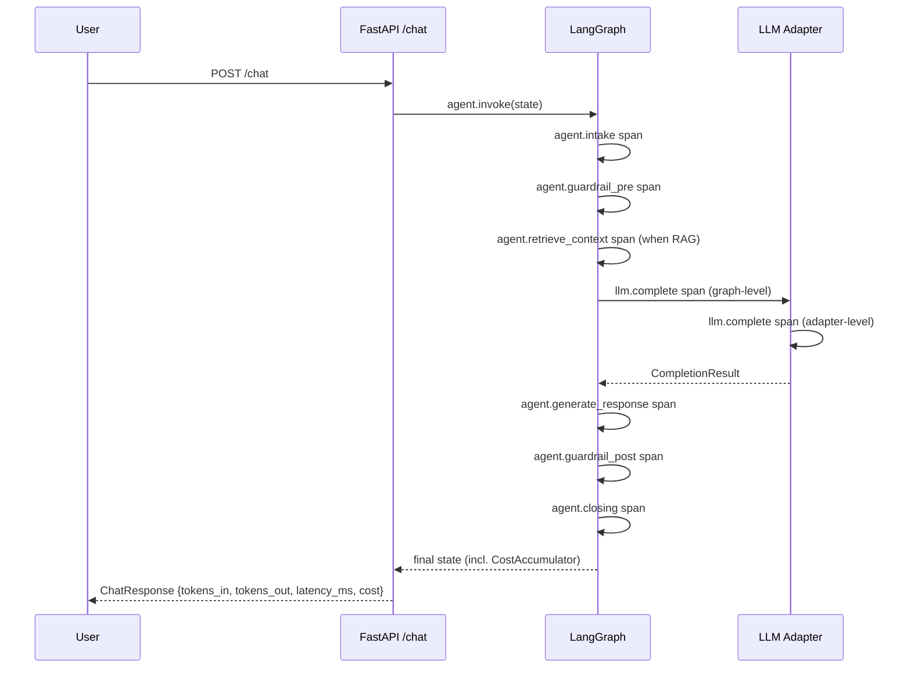

:::caution[Documentação de referência: não é um dispositivo médico]
Esta documentação descreve uma implementação de referência pública avaliada com dados 100% sintéticos. É uma referência de capacidades e prontidão, não uma certificação de conformidade nem aconselhamento jurídico, e não é um dispositivo médico. Não é clinicamente validada e não manipula PHI de produção.
:::

# Observabilidade

> Um formato de fio (OpenTelemetry + OpenInference), três destinos de
> exportação (Langfuse Cloud Hobby, Phoenix auto-hospedado, OTLP genérico) e
> um acumulador de custo + latência por turno que chega em cada resposta de
> `/chat` e em cada relatório de avaliação. Veja a
> [ADR-0006](/ai-agent-eval-harness-healthtech-docs/pt-br/adr/adr-0006-observability/) para a decisão; este arquivo é o
> manual do operador.

## 1. Visão geral

O agente emite spans OpenTelemetry anotados com convenções semânticas
OpenInference. Os spans cobrem os nós do LangGraph
(`agent.intake`, `agent.guardrail_pre`, `agent.retrieve_context`,
`agent.generate_response`, `agent.guardrail_post`, `agent.closing`,
mais `agent.review_response` quando o nó HITL opcional está habilitado)
mais a chamada de LLM (`llm.complete`). Contagens de tokens, latência, nome do
modelo e contagens de decisões viajam nos spans como atributos. O texto da
mensagem do usuário nunca viaja.

Três backends consomem o mesmo formato de fio:

- **Langfuse Cloud Hobby** para a **demonstração ao vivo** no Hugging Face
  Spaces. Camada gratuita: 50K observações / mês, retenção de 30 dias,
  interface hospedada com compartilhamento por link público.
- **Phoenix auto-hospedado** para o **CI de avaliação**. Levantado via a pilha
  Docker Compose opcional; sem cota, sem rede externa.
- **OTLP/HTTP genérico** para operadores que já enviam traces ao Datadog,
  Grafana, Honeycomb ou qualquer outra pilha compatível com OTLP. Configurado
  via `OTLP_ENDPOINT`.

Os três backends estão desligados por padrão. O agente ainda produz um
`TracerProvider` com um exportador em memória que descarta spans, então
`tracer.start_as_current_span(...)` é sempre seguro de chamar.

## 2. Formato de fio

O agente usa o OpenInference, as convenções semânticas da Arize para GenAI. O
OpenInference roda sobre o OpenTelemetry e adiciona atributos específicos de
LLM que o OTel puro não cobre (modelo, provedor, uso de tokens, contextos de
recuperação, chamadas de ferramenta).

A auto-instrumentação para LangChain (cobre o LangGraph), OpenAI e Anthropic é
instalada quando o extra opcional `obs` está presente. O código do agente
também emite spans explícitos para cada nó + cada chamada de LLM, então a
árvore de trace é legível mesmo quando a auto-instrumentação está ausente (por
exemplo, dentro de um processo de teste de unidade).

## 3. Os três backends

### 3.1 Langfuse Cloud Hobby (demonstração ao vivo)

Padrão para a demonstração ao vivo do Hugging Face Spaces.

Cadastre-se em <https://cloud.langfuse.com>, crie um projeto, copie as chaves
pública + secreta.

```bash
export LANGFUSE_PUBLIC_KEY=pk-lf-...
export LANGFUSE_SECRET_KEY=sk-lf-...
# Opcional; o padrão é https://cloud.langfuse.com
export LANGFUSE_HOST=https://cloud.langfuse.com
```

Reinicie a API; o lifespan do FastAPI instala um processador de span OTLP
vinculado ao Langfuse sobre o processador padrão. Abra o dashboard do Langfuse
em `${LANGFUSE_HOST}/project/...` para inspecionar os traces.

### 3.2 Phoenix auto-hospedado (CI de avaliação)

Padrão para as execuções de avaliação offline.

```bash
make obs-up
export PHOENIX_OTLP_ENDPOINT=http://localhost:6006/v1/traces
uv run python -m ai_agent_eval.evals run --locale all --with-phoenix
```

O Phoenix escuta em `:6006` (UI + OTLP/HTTP) e `:4317` (OTLP/gRPC). O
armazenamento de traces persiste no volume Docker `phoenix_data`; derrube a
pilha com `make obs-down` quando terminar.

### 3.3 OTLP/HTTP genérico

Para operadores que já têm um endpoint OTLP.

```bash
export OTLP_ENDPOINT=https://otlp.example.com/v1/traces
```

O lifespan instala um `OTLPSpanExporter` apontado para essa URL.

### 3.4 Pydantic Logfire (alternativa documentada)

O Logfire entrega um SDK Python com uma camada gratuita de 10M spans por mês
em vigor a partir de 2026-01-01. O formato de fio OpenInference significa que
trocar para o Logfire é uma mudança de configuração, não uma mudança de
código: instale `logfire`, configure seu exportador OTLP contra
`https://logfire-api.pydantic.dev/v1/traces` e desabilite o processador do
Langfuse. A distribuição não entrega um módulo de backend Logfire de primeira
classe - isso é deixado ao operador que o escolher.

## 4. Modelo de span



O agente sempre emite um span `llm.complete` na camada do grafo. Os adaptadores
reais (Groq, Cerebras, Anthropic) emitem um segundo span `llm.complete` na
camada do adaptador para a chamada HTTP real. Os fakes de teste não possuem um
tracer, então o span da camada do grafo mantém a topologia consistente.

O tempo por nó também é exposto fora do pipeline OTel. O modo de streaming SSE
em `/chat` e `/chat/resume` (veja a
[ADR-0010](/ai-agent-eval-harness-healthtech-docs/pt-br/adr/adr-0010-streaming-execution-graph/)) emite um evento
`node_started` e um `node_completed` por nó executado, com o `node_completed`
carregando um `duration_ms` medido pelo emissor - o intervalo de relógio de
parede entre os eventos de início e fim do nó para o run id correspondente.
Esse número é medido independentemente dos spans OTel acima (não é uma duração
de span de tracing) e alimenta o Agent Execution Graph da demonstração; os
spans OTel permanecem o registro de observabilidade autoritativo exportado ao
Langfuse e ao Phoenix.

## 5. O que é registrado (e o que NÃO é)

Cada span carrega apenas METADADOS:

- `service.name`, `service.namespace=healthtech-demo`,
  `service.version`, `deployment.environment`
- `agent.node` (um de `intake / guardrail_pre / retrieve_context /
  generate_response / guardrail_post / closing`)
- `agent.tokens_in`, `agent.tokens_out`, `agent.latency_ms`
- `agent.guardrail_decisions_count`, `agent.citations_count`
- `llm.provider` (`groq` / `cerebras` / `anthropic`), `llm.model`,
  `llm.tokens_in`, `llm.tokens_out`, `llm.latency_ms`,
  `llm.finish_reason`

**Nenhum atributo de span carrega o texto da mensagem do usuário, o texto da
resposta do assistente ou qualquer PHI.** Isto é imposto por um teste de
unidade dedicado que afirma o invariante de privacidade. Violar este invariante
significa um gate de CI reprovado. A motivação é a
[postura regulatória](/ai-agent-eval-harness-healthtech-docs/pt-br/reference/regulatory-posture/): os traces deixam o processo
local; as mensagens do usuário não devem.

Se você precisar inspecionar uma transcrição, faça isso a partir dos logs do
FastAPI no ambiente confiável, NÃO a partir do armazenamento de traces. Um
trabalho futuro poderia adicionar um botão opt-in `trace.include_content=True`
com reconhecimento explícito do operador; hoje a resposta é "não".

## 6. Orçamentos de custo e latência

Os orçamentos por turno vivem nas configurações da aplicação:

| Configuração | Padrão | Variável de ambiente |
| --- | --- | --- |
| `cost_budget_tokens_in_per_turn` | 4000 | `COST_BUDGET_TOKENS_IN_PER_TURN` |
| `cost_budget_tokens_out_per_turn` | 1000 | `COST_BUDGET_TOKENS_OUT_PER_TURN` |
| `cost_budget_latency_ms_per_turn` | 8000 | `COST_BUDGET_LATENCY_MS_PER_TURN` |

O executor de avaliação compara os números médios por turno do corpus contra
esses orçamentos. O gate de custo é **estrito e bloqueia o PR** por padrão: a
CLI de avaliação encerra com código não-zero quando a média do corpus por turno
viola qualquer orçamento, e o relatório legível por humanos carrega uma tabela
de status por dimensão e uma linha resolvida `[cost-gate=PASS|WARN|FAIL|off]`
sob a seção "Cost & latency". Passe `--cost-gate warn` para comportamento
apenas-de-aviso ou `--cost-gate off` para suprimir a renderização de custo
inteiramente. Como uma válvula de escape sem chave, o gate estrito se degrada
automaticamente para apenas-de-aviso quando nenhuma chave de provedor capaz de
juiz está definida, de modo que um PR sem chave não pode falhar por custo.

Para sobrescrever os padrões de orçamento, defina as variáveis de ambiente (um
arquivo `.env` funciona da mesma forma que as chaves de LLM).

## 7. Início rápido local

```bash
# 1. Suba a pilha de observabilidade opcional (Phoenix).
make obs-up

# 2. Conecte a CLI de avaliação para enviar traces ao Phoenix.
export PHOENIX_OTLP_ENDPOINT=http://localhost:6006/v1/traces
uv run python -m ai_agent_eval.evals run \
  --locale all \
  --with-phoenix \
  --report-dir evals/reports

# 3. Abra a UI do Phoenix.
#    http://localhost:6006
```

Para a API ao vivo + Langfuse:

```bash
export LANGFUSE_PUBLIC_KEY=pk-lf-...
export LANGFUSE_SECRET_KEY=sk-lf-...
uv run uvicorn ai_agent_eval.api.main:app --reload
# Abra https://cloud.langfuse.com/project/<id>/traces
```

## 8. Teto da camada gratuita

O Langfuse Cloud Hobby limita em **50K observações / mês** sem cobrança de
excedente - o tráfego de pico acima do limite é descartado silenciosamente.
Isto é intencional: a URL da demonstração ao vivo mantém uma garantia de custo
de `$0 / mês`.

Quando o teto é atingido, as opções são:

1. **Parar de enviar traces** ao Langfuse: remova
   `LANGFUSE_PUBLIC_KEY` / `LANGFUSE_SECRET_KEY` e reimplante.
2. **Trocar para o Logfire** (10M spans/mês grátis): veja a §3.4.
3. **Fazer upgrade do Langfuse** para Pro (camada paga).
4. **Auto-hospedar o Langfuse** via o serviço comentado na pilha Docker Compose
   opcional.

Para o caminho de CI de avaliação, o backend Phoenix auto-hospedado não tem teto
de cota no armazenamento de traces; a restrição operativa ali é o gate de custo
estrito que bloqueia o PR (§6), não uma cota de observações.

## 9. Modos de falha

| Sintoma | Causa provável | Correção |
| --- | --- | --- |
| Sem spans no Langfuse | Chaves não definidas ou host errado | Reverifique as variáveis de ambiente |
| `make obs-up` dá erro | Daemon do Docker não está rodando | Inicie o Docker |
| UI do Phoenix vazia | `PHOENIX_OTLP_ENDPOINT` não definido no produtor | Exporte a variável de ambiente antes de rodar a avaliação |
| `make eval` trava > 10 s | Exportador OTLP bloqueado em um endpoint ausente | Remova os endpoints OTLP / reinicie a avaliação |
| Relatório de custo ausente | Unidades de custo nunca registradas | O grafo acrescenta unidades de custo a partir do nó de geração; confirme contra o caminho de teste de relatório de custo |
